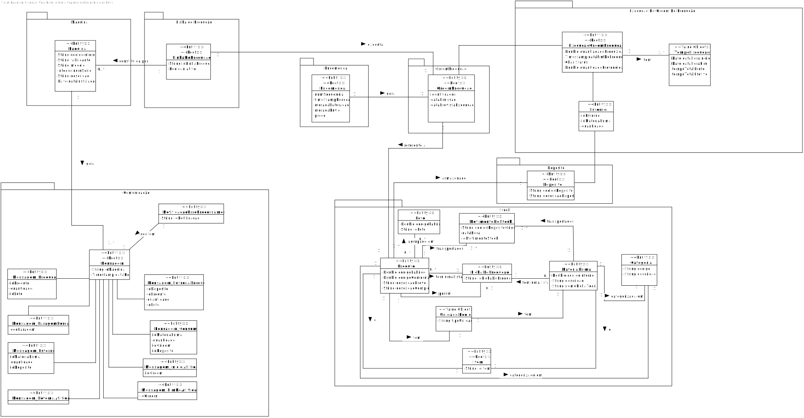
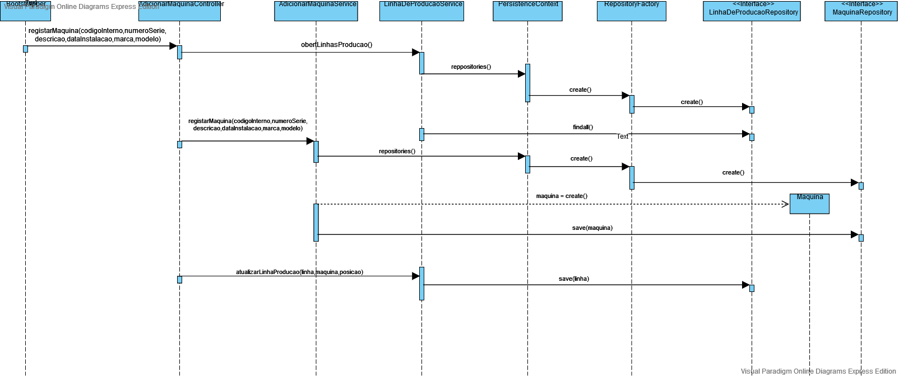

# [1017] - Simulação de registo de uma Máquina
=======================================

# 1. Requisitos

**Descrição**: Como **Gestor de Projeto**, eu pretendo que a equipa desenvolva uma aplicação que simule o registo de uma máquina.

**Fluxo Principal**
* O Gestor de Projeto deve estar logado no sistema.
* O Gestor de Projeto deve introduzir os dados necessários para a realização da simulação (argumentos).
* O sistema irá posteriormente validar os dados introduzidos e proceder à execução, caso possível.

**Regras de negócio**

As máquinas industriais são identificadas através de um número de identificação único (**unique identification number**), que corresponde a um número inteiro positivo entre **1** e **65535**.

# 2. Análise

* A partir da análise do modelo de domínio atual, conclui-se que o mesmo satisfaz as condições exigidas pelo UC.

# 3. Design

## 3.1. Realização da Funcionalidade

## 3.2. Diagrama de Classes

*Nesta secção deve apresentar e descrever as principais classes envolvidas na realização da funcionalidade.*

## 3.3. Padrões Aplicados

| **Questão: Que classe...**       | **Resposta**                       | **Justificação**                                         |
|----------------------------------|------------------------------------|----------------------------------------------------------|
| ...coordena o UC?                | RegistarMaquinasController | Controller                                               |
| ...cria/instancia Maquinas? | RegistarMaquinasController | Creator                                                  |
| ...persiste Maquinas?       |MaquinaRepository                  | Repository.     |

# 4. Implementação
Neste caso de uso, nós iremos fazer o bootstrap das maquinas. Começamos por usar um metodo de **register** chamado pela classe **MaquinaBootstrapper**, que irá passar como pârametros os atributos de uma maquina (i.e. Linha de Producao, código Interno, número de Série, descrição, date de instalção, marca, modelo e posicao). Este método irá pertencer à classe **RegistarMaquinaController**. De seguida, este método irá adicionar à base de dados a partir da classe **MaquinaRepository**. Finalmente atualiza a Linha de produção, adicionando uma máquina a uma posição.

# 5. Observações

Tendo tido problemas com a configuração do Maven, não tive oportunidade para testar devidamente o código.
