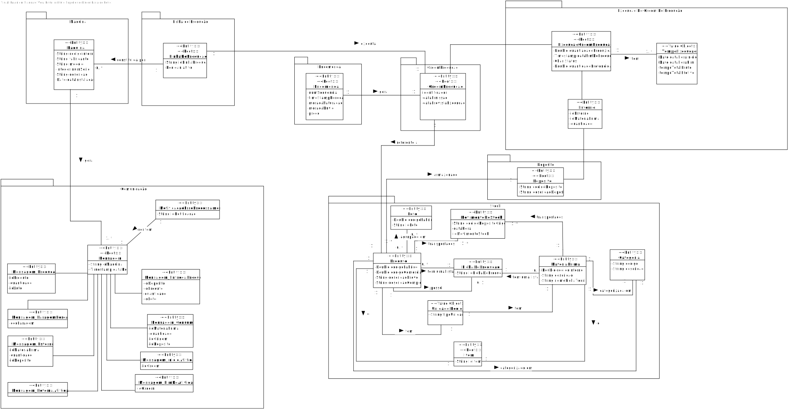

#[2012] - Consultar ordens de produção de uma dada encomenda
=======================================

# 1. Requisitos

**Descrição:** Como **Gestor de produção**, eu pretendo consultar as ordens de produção de uma dada encomenda.

**Fluxo Principal**
* O Gestor de produção inicia o processo de consulta de ordens de produção de uma dada encomenda.
* O sistema apresenta todas as encomendas e pede que escolha uma para apresentar as suas ordens de produção.
* O gestor de produção escolhe a encomenda a consultar.
* O sistema apresenta as ordens de produção.

**Pré-Requisitos**
* O Gestor de produção deve estar logado no sistema

**Regras de Negócio**
*  Uma **Encomenda** tem um identificador e possui um conjunto de ordens de produção.

# 2. Análise

* A partir da análise do modelo de domínio atual, conclui-se que o mesmo satisfaz as condições exigidas pelo UC.

# 3. Design

## 3.1. Realização da Funcionalidade

## 3.2. Diagrama de Classes

*Nesta secção deve apresentar e descrever as principais classes envolvidas na realização da funcionalidade.*

## 3.3. Padrões Aplicados

| **Questão: Que classe...**       | **Resposta**                       | **Justificação**                                         |
|----------------------------------|------------------------------------|----------------------------------------------------------|
| ...interage com o utilizador?    | ConsultarOredemDeProducaoUI                  | Pure Fabrication                               |
| ...coordena o UC?                | ConsultarOrdemProducaoEncomendaController          | Controller                               |
|...persiste maquinas?			   |	EncomendaRepository				|			Repository									   |

# 4. Implementação

## Realização dos Requerimentos
**Classes alteradas**
* ConsultarOrdemProducaoAction.java
* ConsultarOrdemProducaoUI.java
* RepositoryFactory.java
* ConsultarOrdemProducaoEncomendaController.java
* ConsultarOrdemProducaoService.java
* Encomenda.java
* OrdemProducao.java
* EncomendaRepository.java
* JpaEncomendaRepository.java
* JpaRepositoryFactory.java

# 5. Observações

Tendo tido problemas com a configuração do Maven, não tive oportunidade para testar devidamente o código.
