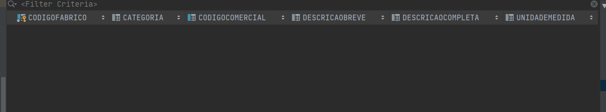

# 1006 - Inicialização de Produtos
=======================================

# 1. Requisitos

**Descrição**: Como **Gestor de Projeto**, eu pretendo que a equipa proceda à inicialização (bootstrap) de produtos.

**Fluxo Principal**
 * O Gestor de Projeto deve estar logado no sistema.
 * O Gestor de Projeto deve introduzir os dados necessários de um produto.
 * O sistema irá posteriormente validar os dados introduzidos e solicitar confirmação.
 * No final, o Gestor de Projeto confirma os dados anteriormente introduzidos.

A interpretação feita deste requisito foi no sentido de respeitar as seguintes condições:

* Um produto é caracterizada por: um código de fabrico, um código comercial, uma descrição breve, uma descrição completa, uma unidade e uma categoria.

**Regras de negócio**

* O código de fabrico e comercial de cada produto deve ser único.

# 2. Análise

*Neste secção a equipa deve relatar o estudo/análise/comparação que fez com o intuito de tomar as melhores opções de design para a funcionalidade bem como aplicar diagramas/artefactos de análise adequados.*

*Recomenda-se que organize este conteúdo por subsecções.*

## 2.1 Questões ao cliente

*As questões e respostas aqui transcritas são as que estão presentes no fórum de esclarecimento de requesitos de LAPR4*

--------
**Q**: Qual é a diferença entre código único de fabrico e o código comercial de um Produto? Em que circunstâncias é utilizado cada um? É o utilizador que introduz estes códigos ou devem ser gerados automáticamente?

**R**: Ambos os códigos são introduzidos pelo utilizador. O código de fabrico é aquele que é usado em contexto de produção do produto para identificar o mesmo. O código comercial é aquele que é usado em contexto comercial (i.e. encomendas, vendas, etc...) e, no limite, é conhecido do publico em geral. Em resumo, ambos identificam univocamente o produto mas refletem perspetivas diferentes.

--------
**Q**: Entende-se por "catálogo de produtos" todos os produtos existentes ou serão apenas alguns produtos? Existe divisão de produtos por catálogos?

**R**: Neste caderno de encargos o termo catálogo é utilizado no sentido de "todos os X" (e.g., catálogo de produtos = todos os produtos).

---------
**Q**: O código comercial de cada produto é único, ou diferentes produtos podem ter o mesmo código?

**R**: O código comercial também é único.

---------
**Q**: Existem regras/restrições para os atributos de um produto?

**R**: A descrição breve tem no máximo 30 caracteres.

---------

**Q**: Existe uma coluna "Unidade". Isso quer dizer que cada produto tem uma unidade de medida única associada? Ou seja, por exemplo, parafusos seria sempre medido em quilogramas, e nunca outra unidade de medida? Ou parafusos podem medidos umas vezes em quilogramas, e outras vezes em unidades de parafusos? E caso seja esta última opção, como compararíamos unidades de parafusos com quilogramas de parafusos?

**R**: Um produto e/ou matéria-prima têm uma única unidade de medida associada. No exemplo, o produto "parafuso" poderia ter associada a medida "unidade". Na hipótese de também ser usada outra medida (e.g. "kg") isso corresponderia a outro produto, isto é, com outro identificador/código.

# 3. Design

Esta funcionalidade não é um verdadeiro UC por isso não será implementada uma UI, será invocada através da aplicação **Bootstarpapp** que guardará num repositório os produtos atualmente identificados.

## 3.1. Realização da Funcionalidade

## 3.2. Diagrama de Classes

## 3.3. Padrões Aplicados

| **Questão: Que classe...**       | **Resposta**                       | **Justificação**                                         |
|----------------------------------|------------------------------------|----------------------------------------------------------|
| ...coordena o UC?                | RegistarProdutosController | RegistarProdutosController                                               |
| ...cria/instancia Produtos? | RegistarProdutosController | Creator                                                  |
| ...persiste Produtos?       | ProdutoRepository                  | Repository.     |

## 3.4. Testes
*Nesta secção deve sistematizar como os testes foram concebidos para permitir uma correta aferição da satisfação dos requisitos.*

**Teste tipo 1:** Verificar que não é possível criar uma instância da classe Produto com valores nulos.

	@Test(expected = IllegalArgumentException.class)
		public void ensureNullIsNotAllowed() {
		Produto instance = new Produto(null, null, null, null, null, null);
	}
*Para se criar uma instância produto é necessário que todos os seus atributos não sejam nulos, logo também irão ser feitos testes individuais (a cada atributo) que seguem a mesma lógica, não sendo necessário menciona-los todos aqui.*

**Teste tipo 2:** Verificar que não é possível criar uma instância da classe Produto com um valor de codigoFabrico já existente.

	@Test(expected = IllegalArgumentException.class)
		public void ensureRepeatedIsNotAllowed() {
    Produto a = new Produto("X123","x3","rolha","rolha de cortiça", new UnidadeMedida("10 g"), new Categoria("P1","cortiça"))
		Produto instance = new Produto("X123", "x4","pneu","pneu automovel", new UnidadeMedida("1 kg"), new Categoria("P1","automovel"));
	}

*Para se criar uma instância produto, o codigo de fabrico e codigo comercial têm de ser unicos, logo também iria ser feito um teste individual ao código comercial, seguindo a mesma lógica, não sendo necessário coloca-lo aqui.*

**Teste tipo 3:** Verificar que não é possível criar uma instância da classe Produto com uma descrição breve acima dos 30 caracteres.

	@Test(expected = IllegalArgumentException.class)
		public void ensureRepeatedIsNotAllowed() {
		Produto instance = new Produto("X123", "x4","pneu feito de borracha para um autocarro","pneu automovel", new UnidadeMedida("1 kg"), new Categoria("P1","automovel"));
	}

# 4. Implementação

Neste caso de uso, nós iremos fazer o bootstrap dos produtos. Começamos por usar um metodo de register, chamado pela classe "ProdutosBootstrapper", que irá passar como pârametros os atributos de um produto (i.e. codigoFabrico, codigoComercial, descicaoBreve, descricaoCompleta, Categoria e UnidadeMedida). Este método irá pertencer á classe RegistarProdutoController, que também vai ser usada no UC 2006 - Adicionar um produto ao catálogo. De seguida, este método irá criar novas instâncias de categorias e unidades de medida para atribuir aos produtos e por fim cria novos produtos e adiciona á base de dados (Através do ProdutosRepository)

# 5. Integração/Demonstração

## Antes de rodar o programa

## Depois de rodar o programa

# 6. Observações

*Nesta secção sugere-se que a equipa apresente uma perspetiva critica sobre o trabalho desenvolvido apontando, por exemplo, outras alternativas e ou trabalhos futuros relacionados.*
