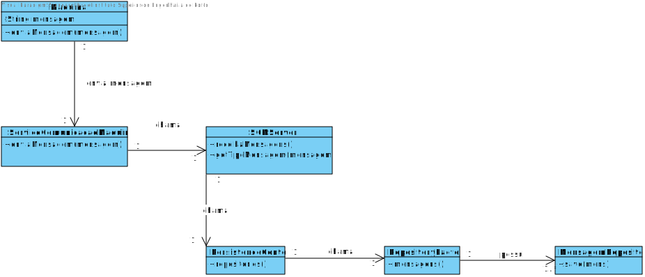

# 1013 - Comunicações entre o SCM e as Máquinas protegidas (SSL/TLS)
=======================================

# 1. Requisitos

**Descrição**: Como **Gestor de Projeto**, eu pretendo que a equipa desenvolva uma aplicação que simule a comunicação entre o SCM e as máquinas, nomeadamente no envio de mensagens geradas por estas. As comunicações entre o simulador de máquina e o SCM devem estar protegidas (SSL/TLS).

**Fluxo Principal**
* O Gestor de Projeto deve estar logado no sistema.
* O Gestor de Projeto deve introduzir os dados necessários para a realização da simulação (argumentos/parâmetros).
* O sistema irá posteriormente validar os dados introduzidos e proceder à execução, caso possível.

A interpretação feita deste requisito foi no sentido de respeitar as seguintes condições:

* Uma máquina não pode emitir duas mensagens no mesmo instante de tempo.
* O SCM pode recolher mensagens de várias máquinas ao mesmo tempo.
* O SCM só recolhe as mensagens de uma determinada linha de produção

**Regras de negócio**

Por fim, assume-se que as máquinas industriais são identificadas através de um número de identificação único (**unique identification number**), que corresponde a um número inteiro positivo entre **1** e **65535**.

Uma **Mensagem** enviada através de um socket possui a seguinte estrutura:

**Tipos de Códigos** de uma **Mensagem**.

# 2. Análise
*As questões e respostas aqui transcritas são as que estão presentes no fórum de esclarecimento de requesitos de LAPR4*

--------
**Q**: -

**R**: -
-------

* A partir da análise do modelo de domínio atual, conclui-se que o mesmo satisfaz as condições exigidas pelo UC.

**Questões em aberto**
* Qual a frequência deste UC?
* O SCM deve fazer algum tipo de processamento antes de guardar na base de dados?

# 3. Design

## 3.1. Realização da Funcionalidade

**Nota**: SD igual ao **UC4002**, com a exceção dos método **enviaMensagem(mensagem)** que passa a ser **SSL_enviaMensagem(mensagem)**.

## 3.2. Diagrama de Classes

**Nota**: CD igual ao **UC4002**, com a exceção dos método **enviaMensagem(mensagem)** que passa a ser **SSL_enviaMensagem(mensagem)**.

## 3.3. Padrões Aplicados

| **Questão: Que classe...**       | **Resposta**                       | **Justificação**                                         |
|----------------------------------|------------------------------------|----------------------------------------------------------|
| ...interage com a Maquina?    | ServicoComunicacaoMaquinas                  | Pure Fabrication                                         |
| ...coordena o UC?                | SCMServer   (controller)       | Controller                                               |

## 3.4. Testes
*Nesta secção deve sistematizar como os testes foram concebidos para permitir uma correta aferição da satisfação dos requisitos.*

**Teste tipo 1:** Verificar que não é possível criar uma instância da classe Mensagem com valores nulos.

	@Test(expected = IllegalArgumentException.class)
		public void ensureNullIsNotAllowed() {
		Mensagem instance = new Mensagem(null, null, null);
	}
*Para se criar uma instância mensagem é necessário que todos os seus atributos não sejam nulos, logo também irão ser feitos testes individuais (a cada atributo) que seguem a mesma lógica, não sendo necessário menciona-los todos aqui.*

**Teste tipo 2:** Verificar que não é possível criar uma instância da classe Mensagem referente a uma máquina não existente.

	@Test(expected = IllegalArgumentException.class)
		public void ensureMaquinaExiste() {
    Mensagem instance = new Mensagem("maquinaNaoIdentificada", "tipoMensagem", 2020/07/04);
	}

*Para se criar uma instância mensagem é necessário que o código da máquina pertença a uma máquina já existente em sistema.*

# 4. Implementação

Este Use Case foi inteiramente implementado em java.

# 5. Integração/Demonstração

*Nesta secção a equipa deve descrever os esforços realizados no sentido de integrar a funcionalidade desenvolvida com as restantes funcionalidades do sistema.*

# 6. Observações

*Nesta secção sugere-se que a equipa apresente uma perspetiva critica sobre o trabalho desenvolvido apontando, por exemplo, outras alternativas e ou trabalhos futuros relacionados.*
