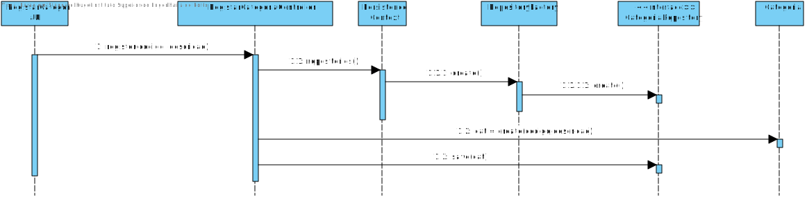

# 2002 - Definir nova categoria de matérias-primas
=======================================

# 1. Requisitos

**Descrição**: Como **Gestor de Projeto**, eu pretendo conseguir definir uma nova categoria de matérias-primas.

**Fluxo Principal**
 * O Gestor de Projeto deve estar logado no sistema.
 * O Gestor de Projeto deve introduzir os dados necessários de uma categoria de matérias-primas.
 * O sistema irá posteriormente validar os dados introduzidos e solicitar confirmação.
 * No final, o Gestor de Projeto confirma os dados anteriormente introduzidos.

A interpretação feita deste requisito foi no sentido de respeitar as seguintes condições:

* Uma categoria de matérias-primas é caracterizada por: um código identificador e uma descrição.

**Regras de negócio**

* O código indentificador tem de ser único.

# 2. Análise

*As questões e respostas aqui transcritas são as que estão presentes no fórum de esclarecimento de requesitos de LAPR4*

--------
**Q**: No âmbito de uma matéria prima ter uma categoria gostaria de saber a constituição desta(creio que ainda não tenha sido referido) e as regras/restrições quanto à semântica e valores dessa constituição.

**R**: Uma categoria tem um código (alfanumérico 10 caracteres no máximo) e uma descrição. A semântica é dada pelo utilizador do sistema.

# 3. Design

## 3.1. Realização da Funcionalidade

## 3.2. Diagrama de Classes

## 3.3. Padrões Aplicados

| **Questão: Que classe...**       | **Resposta**                       | **Justificação**                                         |
|----------------------------------|------------------------------------|----------------------------------------------------------|
| ...interage com o utilizador?    | RegistarCategoriaUI         | Pure Fabrication                                         |
| ...coordena o UC?                | RegistarCategoriaController | Controller                                               |
| ...cria/instancia Categoria? | RegistarCategoriaController | Creator                                                  |
| ...persiste Categoria?       | CategoriaRepository                  | Repository.      |

## 3.4. Testes
*Nesta secção deve sistematizar como os testes foram concebidos para permitir uma correta aferição da satisfação dos requisitos.*

**Teste tipo 1:** Verificar que não é possível criar uma instância da classe Categoria com valores nulos.

   @Test(expected = IllegalArgumentException.class)  
      public void ensureNullIsNotAllowed() {  
      Categoria instance = new Categoria(null, null);  
   }
*Para se criar uma instância categoria é necessário que todos os seus atributos não sejam nulos, logo também irão ser feitos testes individuais (a cada atributo) que seguem a mesma lógica, não sendo necessário menciona-los todos aqui.*

**Teste tipo 2:** Verificar que não é possível criar uma instância da classe Categoria com um codigo já existente.

  	@Test(expected = IllegalArgumentException.class)
  		public void ensureRepeatedIsNotAllowed() {        
      Categoria instance = new Categoria("C1", "descrição");  
      Categoria instance = new Categoria("C1", "nova descrição");  
  	}

**Teste tipo 3:** Verificar que não é possível criar uma instância da classe Categoria com um codigo com mais de 10 caracteres.

      	@Test(expected = IllegalArgumentException.class)
      		public void ensureRepeatedIsNotAllowed() {        
          Categoria instance = new Categoria("C12344567890", "descrição");  
      	}

# 4. Implementação

Neste caso de uso, nós iremos definir categorias. Começamos por chamar o método execute, presente na classe DefinirCategoriaAction. Este método, irá nos levar para a classe RegistarCategoriaUI, onde iremos comunicar com o utilizador de modo a saber que dados é que ele quer introduzir para o registo da categoria (i.e. código e descrição). De seguida, iremos passar esses dados como atributo para o RegistarCategoriaController que irá criar uma nova instância de Categoria e por fim regista-la na base de dados (Através do CategoriaRepository).

# 5. Integração/Demonstração

c

# 6. Observações

*Nesta secção sugere-se que a equipa apresente uma perspetiva critica sobre o trabalho desenvolvido apontando, por exemplo, outras alternativas e ou trabalhos futuros relacionados.*
