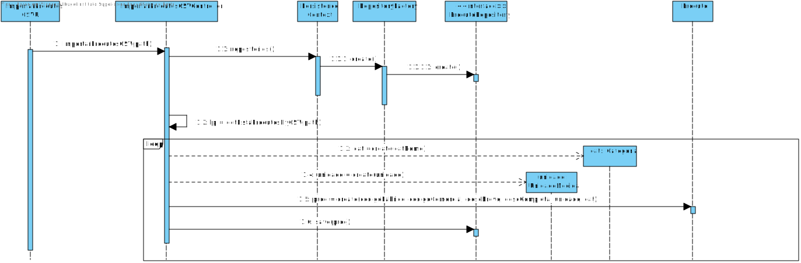
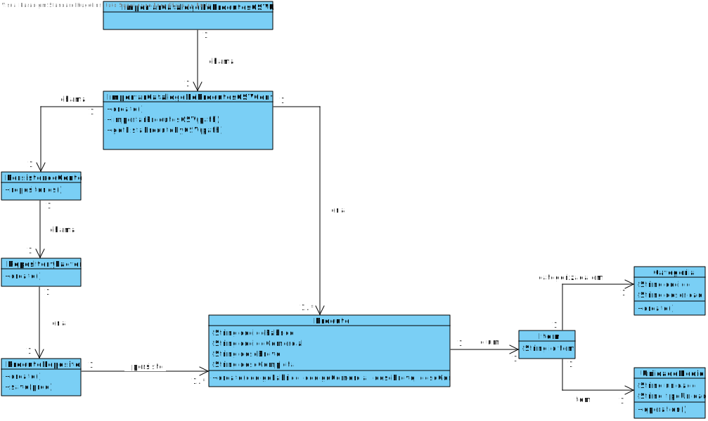
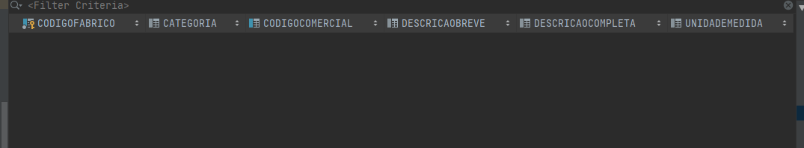
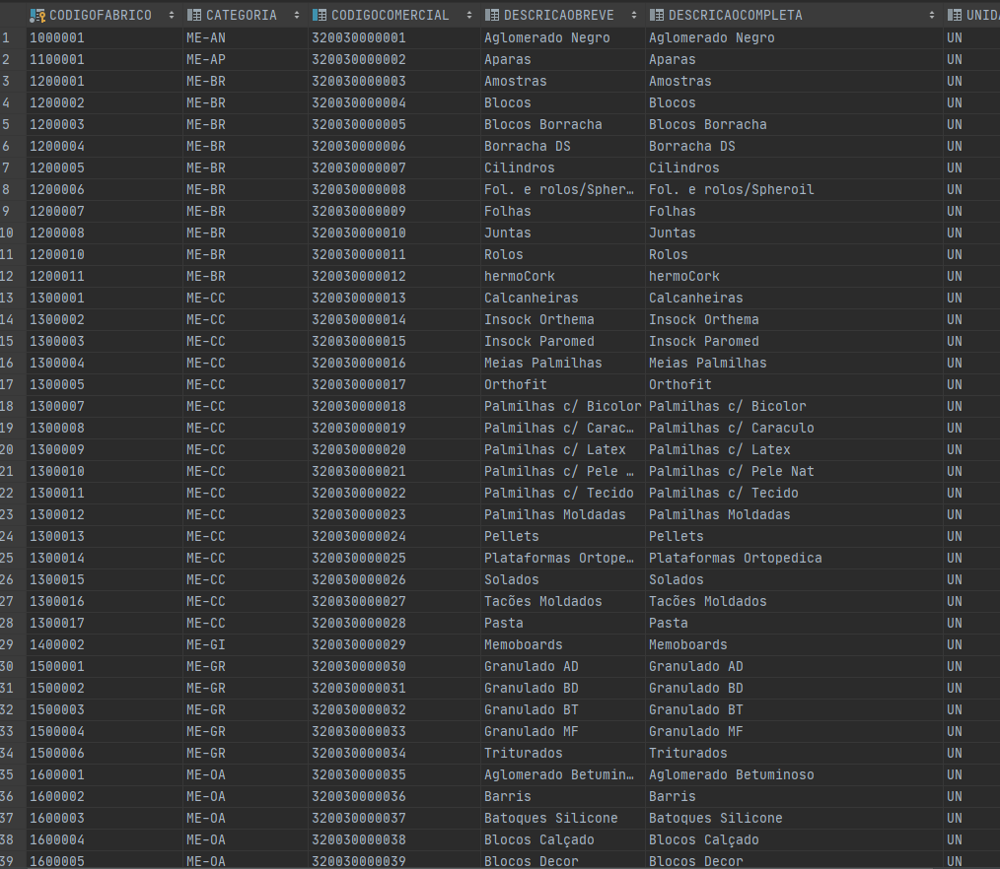

# 2005 - Importar o catálogo de produtos através de um CSV
=======================================

# 1. Requisitos

**Descrição**: Como **Gestor de Projeto**, eu pretendo conseguir importar um catálogo de produtos através de um CSV.

**Fluxo Principal**
 * O Gestor de Projeto deve estar logado no sistema.
 * O Gestor de Projeto deve introduzir os dados necessários para se conseguir retirar informação de um ficheiro.
 * O sistema irá posteriormente validar os dados introduzidos e solicitar confirmação.
 * No final, o Gestor de Projeto confirma os dados anteriormente introduzidos.

A interpretação feita deste requisito foi no sentido de respeitar as seguintes condições:

* Um produto é caracterizada por: um código de fabrico, um código comercial, uma descrição breve e uma descrição completa.
* O ficheiro a importar terá de ser do formato CSV e no processo de importação irá ser utilizado o seu Path.

**Regras de negócio**

Quanto ao produto:
* O código de fabrico e comercial de cada produto deve ser único.

Quanto ao ficheiro:
* O path do ficheiro deve ser válido.

# 2. Análise

*As questões e respostas aqui transcritas são as que estão presentes no fórum de esclarecimento de requesitos de LAPR4*

--------
**Q**: Ao importar o catálogo de produtos através do ficheiro CSV devemos adicionar os produtos do ficheiro aos produtos já existentes na aplicação, ou eliminar todos os produtos anteriormente existentes na aplicação e adicionar apenas os produtos do ficheiro CSV(sendo esse o novo catálogo)?

**R**: O comportamento deve ser o seguinte:
1. Sem dúvida, adicionar os novos produtos aos já existentes.
2. Questionar o utilizador, se em caso de algum produto já existir se pretende que a informação seja ou atualizada ou ignorada.
3. Não se pretende eliminar nenhum produto.
--------
**Q**: Caso o ficheiro utilizado para importar produtos possua erros de formatação (e.g. número incorreto de atributos) qual deve ser o comportamento do sistema?

**R**: Deve ignorar essas linhas, colocando-as, por exemplo, num ficheiro de erros e no fim dá essa indicação ao utilizador. As linhas sem erros devem ser importadas.
Já agora, no final da importação deveria ser apresentado ao utilizador um resumo quantitativo dos resultados da importação.

--------
**Q**: Existe uma coluna "Unidade". Isso quer dizer que cada produto tem uma unidade de medida única associada? Ou seja, por exemplo, parafusos seria sempre medido em quilogramas, e nunca outra unidade de medida? Ou parafusos podem medidos umas vezes em quilogramas, e outras vezes em unidades de parafusos? E caso seja esta última opção, como compararíamos unidades de parafusos com quilogramas de parafusos?

**R**: Um produto e/ou matéria-prima têm uma única unidade de medida associada. No exemplo, o produto "parafuso" poderia ter associada a medida "unidade". Na hipótese de também ser usada outra medida (e.g. "kg") isso corresponderia a outro produto, isto é, com outro identificador/código.

# 3. Design

## 3.1. Realização da Funcionalidade

## 3.2. Diagrama de Classes

## 3.3. Padrões Aplicados

| **Questão: Que classe...**       | **Resposta**                       | **Justificação**                                         |
|----------------------------------|------------------------------------|----------------------------------------------------------|
| ...interage com o utilizador?    | ImportarProdutosCSVUI         | Pure Fabrication                                         |
| ...coordena o UC?                | ImportarProdutosCSVController | Controller                                               |
| ...cria/instancia Produtos? | ImportarProdutosCSVController | Creator                                                  |
| ...persiste Categoria?       | ProdutoRepository                  | Repository.      |

## 3.4. Testes
*Nesta secção deve sistematizar como os testes foram concebidos para permitir uma correta aferição da satisfação dos requisitos.*

**Teste tipo 1:** Verificar que não é possível importar o ficheiro CSV apartir de um Path nulo.

	@Test(expected = IllegalArgumentException.class)
		public void ensureNullIsNotAllowed() {
		importarProdutosCSV(null);
	}

*Para se importarem produtos, o path do ficheiro CSV tem de ser válido, logo também irá ser testado se o path introduzido existe, teste esse seguindo a mesma lógica e não sendo necessário menciona-lo aqui.*

### Testes relacionados aos produtos importados         

**Teste tipo 2:** Verificar que não é possível criar uma instância da classe Produto com valores nulos.

	@Test(expected = IllegalArgumentException.class)
		public void ensureNullIsNotAllowed() {
		Produto instance = new Produto(null, null, null, null, null, null);
	}
*Para se criar uma instância produto é necessário que todos os seus atributos não sejam nulos, logo também irão ser feitos testes individuais (a cada atributo) que seguem a mesma lógica, não sendo necessário menciona-los todos aqui.*

**Teste tipo 3:** Verificar que não é possível criar uma instância da classe Produto com um valor de codigoFabrico já existente.

	@Test(expected = IllegalArgumentException.class)
		public void ensureRepeatedIsNotAllowed() {
    Produto a = new Produto("X123","x3","rolha","rolha de cortiça", new UnidadeMedida("10 g"), new Categoria("P1","cortiça"))
		Produto instance = new Produto("X123", "x4","pneu","pneu automovel", new UnidadeMedida("1 kg"), new Categoria("P1","automovel"));
	}

*Para se criar uma instância produto, o codigo de fabrico e codigo comercial têm de ser unicos, logo também iria ser feito um teste individual ao código comercial, seguindo a mesma lógica, não sendo necessário coloca-lo aqui.*

**Teste tipo 4:** Verificar que não é possível criar uma instância da classe Produto com uma descrição breve acima dos 30 caracteres.

	@Test(expected = IllegalArgumentException.class)
		public void ensureRepeatedIsNotAllowed() {
		Produto instance = new Produto("X123", "x4","pneu feito de borracha para um autocarro","pneu automovel", new UnidadeMedida("1 kg"), new Categoria("P1","automovel"));
	}

# 4. Implementação

Neste caso de uso, nós iremos acrescentar produtos á base de dados através de um ficheiro CSV. Começamos por chamar o método execute, presente na classe ImportarProdutosCSVAction. Este método, irá nos levar para a classe ImportarProdutosCSVUI, onde iremos comunicar com o utilizador de modo a saber o path do ficheiro CSV com a informação dos produtos. De seguida, iremos passar esses dados como atributo para o ImportarProdutosCSVController que irá fazer o import da informação do ficheiro para uma lista, e por cada linha presente no ficheiro vai criar um Produto a adicionar á tal lista. De seguida, cada produto presente na lista irá ser introduzido na base de dados (Através do ProdutoRepository).

# 5. Integração/Demonstração

## Antes de rodar o programa

## Depois de rodar o programa

# 6. Observações

*Nesta secção sugere-se que a equipa apresente uma perspetiva critica sobre o trabalho desenvolvido apontando, por exemplo, outras alternativas e ou trabalhos futuros relacionados.*
