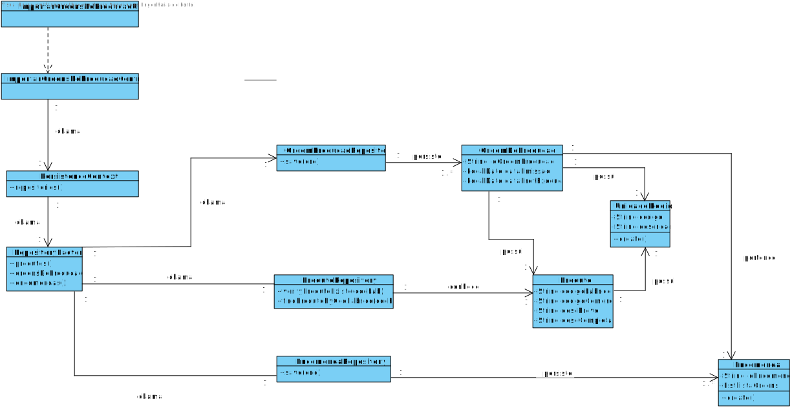

# 2009 - Importar Ordens de Produção através de ficheiro CSV
=======================================

# 1. Requisitos

**Descrição**: Como **Gestor de Produção**, eu pretendo conseguir importar as ordens de produção de produtos através de um CSV.

**Fluxo Principal**
 * O Gestor de Produção deve estar logado no sistema.
 * O Gestor de Produção deve introduzir os dados necessários para se conseguir retirar informação de um ficheiro.
 * O sistema irá posteriormente validar os dados introduzidos e solicitar confirmação.
 * No final, o Gestor de Projeto confirma os dados anteriormente introduzidos.

A interpretação feita deste requisito foi no sentido de respeitar as seguintes condições:

* Uma ordem de produção é caracterizada por: um id, uma data de emissão, uma data prevista de execução, o código de fabrico de um produto, a quantidade a produzir e respetiva unidade e por fim o número da encomenda.
* O ficheiro a importar terá de ser do formato CSV e no processo de importação irá ser utilizado o seu Path.

**Regras de negócio**

Quanto á ordem de produção:
* O código de fabrico do produto deve existir em sistema.
* A data prevista de execução tem de ser posterior á data de emissão.

Quanto ao ficheiro:
* O path do ficheiro deve ser válido.

# 2. Análise

*As questões e respostas aqui transcritas são as que estão presentes no fórum de esclarecimento de requesitos de LAPR4*

--------
**Q**: Um dos aspetos a ter em consideração no que concerne à ordem de produção, é uma data prevista da sua execução (cf. ficheiro csv de exemplo). No entanto, suponhamos que, por algum motivo, a ordem de produção é executada numa data diferente da que estava prevista (antes ou depois, mas sempre após a data de emissão). Devemos considerar a existência de uma data de início em que a mesma é executada (por exemplo, tendo em atenção a mensagem de início de atividade da primeira máquina da linha de produção responsável pela sua execução) ou a data prevista deve ser atualizada?

**R**: A data previsto é simplesmente uma indicação que poderá ou não ser cumprida e, não deve ser atualizada.

Através do processamento das mensagens recebidas das máquinas o sistema deverá ficar a saber qual foi a data/hora inicio e fim da execução da ordem de produção, bem como outras informações relevantes (e.g. tempos, desvios, etc...).
--------
**Q**: Quais são as regras de negócio relativamente ao identificador da ordem de produção e ao identificador das encomendas?

**R**: Devem considerar que ambos são códigos alfanuméricos (e.g. OP0030 ou 100003363).

--------
**Q**: O identificador do produto que é apresentado na ordem de produção é o código único de fábrica ou o código comercial do produto?

**R**: É usado o código de fabrico.
--------
**Q**: Caso seja solicitado na ordem de produção a produção de um produto inexistente ou que não apresenta uma ficha de produção associada (o que inviabiliza a produção do produto), a ordem de produção altera o seu estado para "suspensa" ou é descartada?

**R**: Quando a ordem de produção é importada através de um ficheiro, se o produto não existe, deve ignorar e colocar essa informação num ficheiro de erros. Comportamento semelhante ao solicitado para a importação de produtos.
-------

# 3. Design

## 3.1. Realização da Funcionalidade

## 3.2. Diagrama de Classes

## 3.3. Padrões Aplicados

| **Questão: Que classe...**       | **Resposta**                       | **Justificação**                                         |
|----------------------------------|------------------------------------|----------------------------------------------------------|
| ...interage com o utilizador?    | ImportarOrdensDeProducaoCSVUI         | Pure Fabrication                                         |
| ...coordena o UC?                | ImportarOrdensDeProducaoController | Controller                                               |
| ...cria/instancia OrdemProducao? | ImportarOrdensDeProducaoController | Creator                                                  |
| ...conhece Produtos?       | ProdutoRepository                  | Repository.      |
| ...persiste OrdemProducao?       | OrdemDeProducaoRepository                  | Repository.      |
| ...persiste Encomenda?       | EncomendaRepository                  | Repository.      |

## 3.4. Testes
*Nesta secção deve sistematizar como os testes foram concebidos para permitir uma correta aferição da satisfação dos requisitos.*

**Teste tipo 1:** Verificar que não é possível criar uma instância da classe OrdemDeProducao com valores nulos.

@Test(expected = IllegalArgumentException.class)
public void ensureNullIsNotAllowed() {
    OrdemProducao instance = new OrdemProducao(null, null, null, null, null, null);
}
*Para se criar uma instância OrdemDeProducao é necessário que todos os seus atributos não sejam nulos, logo também irão ser feitos testes individuais (a cada atributo) que seguem a mesma lógica, não sendo necessário menciona-los todos aqui.*

-----
**Teste tipo 2:** Verificar que não é possível criar uma instância da classe OrdemDeProducao com uma data de emissão posterior a uma data de execução.

@Test(expected = IllegalArgumentException.class)
public void ensureDateIsRight() {

    OrdemProducao instance = new OrdemProducao("OP01", new Date(2020,10,10), new Date(2019,10,10),
            "P01", new UnidadeMedida(10,"kgs"),"X01");
}

*Para se criar uma instância OrdemDeProducao, a data de emissão não pode ser superior á data de execução.*

----

# 4. Implementação

Neste caso de uso, nós iremos acrescentar ordens de produção á base de dados através de um ficheiro CSV. Começamos por chamar o método execute, presente na classe ImportarOrdemProducaoCSVAction. Este método, irá nos levar para a classe ImportarOrdemProducaoCSVUI, onde iremos comunicar com o utilizador de modo a saber o path do ficheiro CSV com a informação das ordens de produção. De seguida, iremos passar esses dados como atributo para o ImportarOrdemProducaoCSVController que irá fazer o import da informação do ficheiro para uma lista, e por cada linha presente no ficheiro vai criar uma Ordem de Produção a adicionar á tal lista. De seguida, cada ordem de produção válida presente na lista irá ser introduzida na base de dados (Através do ProdutoRepository).

# 5. Integração/Demonstração

## Depois de rodar o método

# 6. Observações

*Nesta secção sugere-se que a equipa apresente uma perspetiva critica sobre o trabalho desenvolvido apontando, por exemplo, outras alternativas e ou trabalhos futuros relacionados.*
