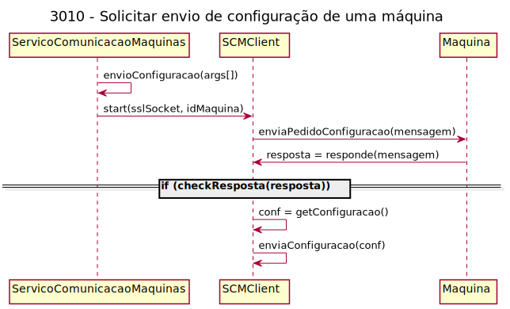
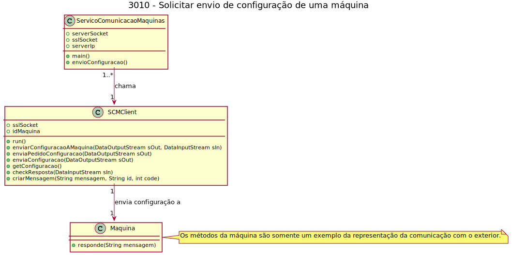
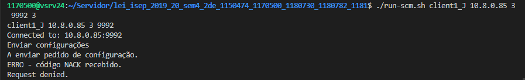
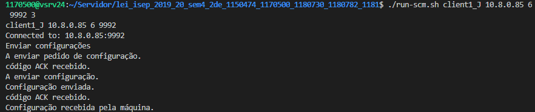

# 3010 - Solicitar envio de configuração de uma máquina
=======================================

# 1. Requisitos

**Descrição**: Como **Gestor de Chão de Fábrica**, eu pretendo solicitar o envio de uma determinada configuração para uma máquina.

**Fluxo Principal**
* O Gestor de Chão de Fábrica deve estar logado no sistema.
* O Gestor de Chão de Fábrica deve introduzir os dados necessários para a realização da simulação (argumentos/parâmetros). Os argumentos/parâmetros são, por ordem, os seguintes:
	- O nome do ficheiro .jks do cliente
	- O IP do servidor com o qual vai comunicar
	- O ID da máquina
	- A porta do servidor com o qual vai comunicar
* O sistema irá posteriormente validar os dados introduzidos e proceder à execução, caso possível.

A interpretação feita deste requisito foi no sentido de respeitar as seguintes condições:

* A máquina precisa de existir em sistema
* Cada máquina só pode receber 1 configuração, e a configuração irá ser um código alfanumérico de 16 letras/números (decisão do grupo).
* O ficheiro será persistido localmente numa pasta

**Regras de negócio**

Por fim, assume-se que as máquinas industriais são identificadas através de um número de identificação único (**unique identification number**), que corresponde a um número inteiro positivo entre **1** e **65535**.

Uma **Mensagem** enviada através de um socket possui a seguinte estrutura:

**Tipos de Códigos** de uma **Mensagem**.

# 2. Análise
*As questões e respostas aqui transcritas são as que estão presentes no fórum de esclarecimento de requesitos de LAPR4*

--------
**Q**: Tendo em conta que o simulador é executado para simular o funcionamento de uma máquina, nós devemos enviar um "pedido" ao simulador em funcionamento para que este receba um ficheiro de configuração? Ou seja, se eu definir que a cadência de um simulador é de 5 minutos e tenho 10 mensagens para importar, posso fazer o pedido de receção do ficheiro de configuração a meio do processamento das mensagens e este ser recebido no fim do processamento ou devo cessar o processamento em andamento para configurar a máquina?

**R**: É suposto conseguir-se enviar um ficheiro de configuração para a máquina (simulador) a qualquer momento, desde que a máquina esteja "ligada".

Nota que os processos em causa (i.e. envio de mensagens e recepção de ficheiro de configuração) podem/devem ocorrer em modo paralelo/concorrente.

-------
**Q**: Na user story 3010, é pedida a solicitação de envio de uma determinada configuração para uma máquina. Caso essa solicitação seja aceite, deve ser essa user story a enviar o ficheiro de configuração?

**R**: Considera-se ainda no âmbito dessa US o envio do ficheiro de configuração para a máquina (através do SCM).
Note-se que a US 1014 também está relacionada com isto.

-------

**Q**: Visto que o simulador da máquina tem de assumir configurações recebidas pelo ficheiro de configuração, seria possível especificar com mais detalhe quais seriam essas configurações (com um ficheiro de exemplo) para que não existam problemas de implementação provenientes de interpretação incorreta?

**R**: O simulador NÃO tem que **assumir** (no sentido de interpretar) as configurações recebidas.

De acordo com a US 1014, o simulador tem apenas que receber um ficheiro de configuração que lhe seja enviado.

Para demonstrar que recebeu corretamente esse ficheiro pode, por exemplo, persisti-lo localmente numa pasta.

Repito o que já disse vezes sem conta: o conteúdo desses ficheiro é texto e a seu estrutura interna é irrelevante para o sistema em desenvolvimento.

-------
* A partir da análise do modelo de domínio atual, conclui-se que o mesmo satisfaz as condições exigidas pelo UC.

**Questões em aberto**
* Qual a frequência deste UC?
* Há algum detalhe extra quanto ao conteúdo do ficheiro, ou é irrelevante?
* O nome do ficheiro tem de ter alguma formatação em especial?

# 3. Design

## 3.1. Realização da Funcionalidade

## 3.2. Diagrama de Classes

## 3.3. Padrões Aplicados

| **Questão: Que classe...**       | **Resposta**                       | **Justificação**                                         |
|----------------------------------|------------------------------------|----------------------------------------------------------|
| ...interage com a Maquina?    | ServicoComunicacaoMaquinas                  | Pure Fabrication                                         |
| ...coordena o UC?                | SCMClient   (controller)       | Controller                                               |

## 3.4. Testes
*Nesta secção deve sistematizar como os testes foram concebidos para permitir uma correta aferição da satisfação dos requisitos.*

Não foram implementados testes, todos os testes do UC foram "manuais".

# 4. Implementação

Este Use Case foi inteiramente implementado em java e comunica com um UC feito em C.

Este caso de uso, vai começar por receber por argumento os atributos referidos na secção dos requisitos. De seguida ele vai fazer a ligação e verificar os certificados, de modo a garantir que a ligação é segura, dar run ao SCMClient e vai começar com o inicio do envio de configuração. Vamos começar por enviar um pedido de configuração á máquina e verificar a resposta da mesma: caso seja uma resposta positiva, vamos então enviar a configuração á máquina. Por fim, vamos voltar a verificar a resposta da máquina de modo a saber se a configuração foi ou não bem enviada, e terminamos o UC.

# 5. Integração/Demonstração

*Nesta secção a equipa deve descrever os esforços realizados no sentido de integrar a funcionalidade desenvolvida com as restantes funcionalidades do sistema.*
## Caso o programa dê erro

## Caso o programa dê certo

# 6. Observações

*Nesta secção sugere-se que a equipa apresente uma perspetiva critica sobre o trabalho desenvolvido apontando, por exemplo, outras alternativas e ou trabalhos futuros relacionados.*

Para que os métodos em java e em c tivessem certificados iguais, foi necessário usar o código seguinte para gerar os ficheiros ".pem" e ".key":

**Export the .crt**:

`keytool -export -alias mydomain -file mydomain.der -keystore mycert.jks`

**Convert the Cert to PEM**:

`openssl x509 -inform der -in mydomain.der -out certificate.pem`

**Export the key**:

`keytool -importkeystore -srckeystore mycert.jks -destkeystore keystore.p12 -deststoretype PKCS12`

**Concert PKCS12 key to unencrypted PEM**:

`openssl pkcs12 -in keystore.p12  -nodes -nocerts -out mydomain.key`

**Source**: [StackOverflow](https://serverfault.com/a/715841)
