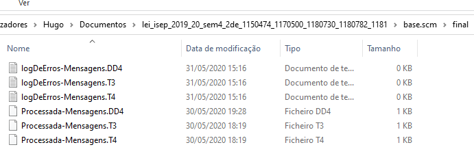

# 4001 - Importar as mensagens dos diretórios de entrada
=======================================

# 1. Requisitos

**Descrição**: Como **Serviço de Comunicação com as Máquinas (SCM)**, pretendo importar, de forma concorrente/paralela, as mensagens existentes nos ficheiros de texto presentes no diretório de entrada de forma a disponibilizar as mesmas para processamento.

**Fluxo Principal**
 * O Serviço de comunicação com as máquinas pede para se fazer o import das mensagens.
 * O sistema importa as mensagens para a base de dados e guarda-as em outro diretório.

A interpretação feita deste requisito foi no sentido de respeitar as seguintes condições:

* Uma mensagem é geralmente caracterizada por: Uma máquina, o seu tipo e a data/hora que foi emitida.
* As mensagens podem ter diversos tipos afetando os seus atributos. Podem ser de:

 - Consumo (C0)
 - Entrega de produção (C9)
 - Produção (P1)
 - Estorno (P2)
 - Inicio de atividade (S0)
 - Retoma de atividade (S1)
 - Paragem (S8)
 - Fim de atividade (S9)

# 2. Análise

*Neste secção a equipa deve relatar o estudo/análise/comparação que fez com o intuito de tomar as melhores opções de design para a funcionalidade bem como aplicar diagramas/artefactos de análise adequados.*

*Recomenda-se que organize este conteúdo por subsecções.*

## 2.1 Questões ao cliente

*As questões e respostas aqui transcritas são as que estão presentes no fórum de esclarecimento de requesitos de LAPR4*

--------
**Q**: O nosso grupo tem uma dúvida em relação aos tipos de ficheiros de mensagens para importação na user story 4001. Devemos considerar que tipos de ficheiros?

**R**: Podem/devem considerar os ficheiros exemplo disponibilizados no Moodle já há algum tempo atrás.

--------
**Q**: independentemente das siglas para os tipos de mensagens devemos considerar que vamos trabalhar apenas com aqueles 8 tipos(do ficheiro exemplo) e que a sua extrutura vai ser aquela ou aquilo são meramente exemplos?

**R**: Por simplificação, podem assumir que a estrutura das mensagens é a sugerida nos exemplos.

---------
**Q**: qual é o comportamento esperado pelo sistema quando uma mensagem não é válida (e.g. o produto mencionado na mensagem não existe ou o número de campos obrigatórios não é respeitado), visto que os Erros mencionados são direcionados a erros de validação do domínio (e.g. a máquina tenta consumir uma quantidade que não existe no depósito)?

**R**:
O comportamento esperado depende sempre daquilo que está em causa.

A equipa, com o conhecimento de negócio que já possui, deve também tentar perceber qual deve ser o comportamento do sistema.

Alguns exemplos:

1. Produto inexistente: deve ser detetado aquando do processamento e deve ser gerado uma alerta de erro para retificação.

2. Estrutura da mensagem incorreta: nem sequer entra no sistema. Deve ser colocada num ficheiro de log e/ou de erros para posterior tratamento.

# 3. Design

## 3.1. Realização da Funcionalidade

## 3.2. Diagrama de Classes

## 3.3. Padrões Aplicados

| **Questão: Que classe...**       | **Resposta**                       | **Justificação**                                         |
|----------------------------------|------------------------------------|----------------------------------------------------------|
| ...interage com o utilizador?    | ImportarMensagensMaquinasUI         | Pure Fabrication                                         |
| ...coordena o UC?                | ImportarMensagensMaquinasController | Controller                                               |
| ...cria/instancia Mensagem? | ImportarMensagensMaquinasController | Creator                                                  |
| ...persiste Mensagem?       | MensagemRepository                  | Repository.     |

## 3.4. Testes
*Nesta secção deve sistematizar como os testes foram concebidos para permitir uma correta aferição da satisfação dos requisitos.*

**Teste tipo 1:** Verificar que não é possível criar uma instância da classe Mensagem com valores nulos.

	@Test(expected = IllegalArgumentException.class)
		public void ensureNullIsNotAllowed() {
		Mensagem instance = new Mensagem(null, null, null);
	}
*Para se criar uma instância mensagem é necessário que todos os seus atributos não sejam nulos, logo também irão ser feitos testes individuais (a cada atributo) que seguem a mesma lógica, não sendo necessário menciona-los todos aqui.*

**Teste tipo 2:** Verificar que não é possível criar uma instância da classe Mensagem referente a uma máquina não existente.

	@Test(expected = IllegalArgumentException.class)
		public void ensureMaquinaExiste() {
    Mensagem instance = new Mensagem("maquinaNaoIdentificada", "tipoMensagem", 2020/07/04);
	}

*Para se criar uma instância mensagem é necessário que o código da máquina pertença a uma máquina já existente em sistema.*

# 4. Implementação

Neste UC, o serviço de comunicação de maquinas (SCM) vai fazer o import de mensagens de um determinado diretório para o sistema, e guarda-las posteriormente num outro diretório de mensagens importadas. Neste caso de uso, começamos por, no ImportarMensagensMaquinasController, guardar numa lista todos os Paths de todos os ficheiros presentes no diretorio inicial. Posteriormente, nós criamos threads e atribuimos-lhe um path a cada (ou seja, cada thread vai tratar de um ficheiro, sendo um número flexivel de threads). De seguida iremos começar todas as threads e estas irão fazer o import das mensgens para a base de dados, e guardar as mensagens erradas num ficheiro á parte de erros. Usamos métodos como getTipoMensagem, que vai buscar a instância de Mensagem correta, de acordo com o seu tipo, e também usamos o metodo getTimestampFromString que como o nome indica irá buscar o timeStamp de acordo com os dados de uma string. Por fim, os ficheiros são passados para outro diretório final.

# 5. Integração/Demonstração

## Antes de rodar o programa

## Depois de rodar o programa

# 6. Observações

*Nesta secção sugere-se que a equipa apresente uma perspetiva critica sobre o trabalho desenvolvido apontando, por exemplo, outras alternativas e ou trabalhos futuros relacionados.*
