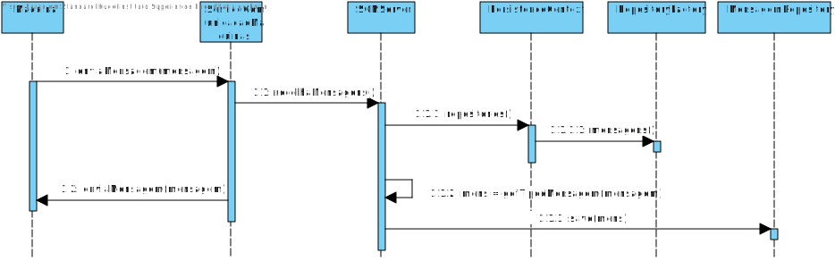

# 4002 - Simulação do funcionamento de uma máquina
=======================================

# 1. Requisitos

**Descrição**: Como **SCM**, eu pretendo recolher as mensagens geradas nas/pelas máquinas de uma determinada linha de produção.

**Fluxo Principal**
* O SCM deve receber as mensagens de uma máquina
* O SCM guarda as mensagens para posterior processamento.
* O SCM responde á maquina o sucesso da operação.
* O sistema irá posteriormente validar os dados guardados.

A interpretação feita deste requisito foi no sentido de respeitar as seguintes condições:

* Uma máquina não pode emitir duas mensagens no mesmo instante de tempo.
* O SCM pode recolher mensagens de várias máquinas ao mesmo tempo.
* O SCM só recolhe as mensagens de uma determinada linha de produção

**Regras de negócio**

Por fim, assume-se que as máquinas industriais são identificadas através de um número de identificação único (**unique identification number**), que corresponde a um número inteiro positivo entre **1** e **65535**.

Uma **Mensagem** enviada através de um socket possui a seguinte estrutura:

**Tipos de Códigos** de uma **Mensagem**.

# 2. Análise

* A partir da análise do modelo de domínio atual, conclui-se que o mesmo satisfaz as condições exigidas pelo UC.

**Questões em aberto**
* Qual a frequência deste UC?
* O SCM deve fazer algum tipo de processamento antes de guardar na base de dados?

# 3. Design

## 3.1. Realização da Funcionalidade

## 3.2. Diagrama de Classes

## 3.3. Padrões Aplicados

| **Questão: Que classe...**       | **Resposta**                       | **Justificação**                                         |
|----------------------------------|------------------------------------|----------------------------------------------------------|
| ...interage com a Maquina?    | ServicoComunicacaoMaquinas                  | Pure Fabrication                                         |
| ...coordena o UC?                | SCMServer   (controller)       | Controller                                               |

## 3.4. Testes
*Nesta secção deve sistematizar como os testes foram concebidos para permitir uma correta aferição da satisfação dos requisitos.*

Não foram implementados testes.
# 5. Integração/Demonstração

## Caso o programa dê certo

# 6. Observações

*Nesta secção sugere-se que a equipa apresente uma perspetiva critica sobre o trabalho desenvolvido apontando, por exemplo, outras alternativas e ou trabalhos futuros relacionados.*
