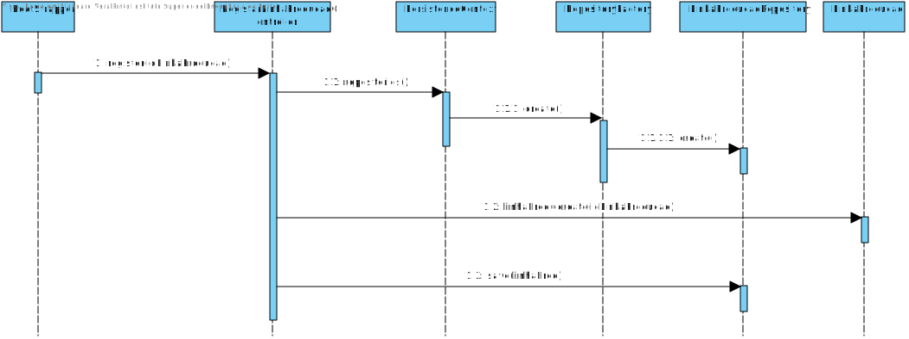
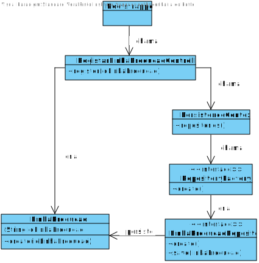
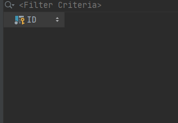
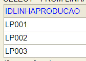

# 1008 - Inicialização de Linhas de Produção
=======================================

# 1. Requisitos

**Descrição:** Como **Gestor de Projeto**, eu pretendo que a equipa proceda à inicialização (bootstrap) de algumas linhas de produção.

**Fluxo Principal**
* O Gestor de Projeto deve estar logado no sistema.
* O Gestor de Projeto deve introduzir os dados necessários de uma linha de produção.
* O sistema irá posteriormente validar os dados introduzidos e solicitar confirmação.
* No final, o Gestor de Projeto confirma os dados anteriormente introduzidos.

A interpretação feita deste requisito foi no sentido de respeitar as seguintes condições:

* Uma linha de produção é caracterizada por: um código identificador.

**Regras de Negócio**
* O código identificador deve ser único.

# 2. Análise

## Questões ao Cliente:

*As questões e respostas aqui transcritas são as que estão presentes no fórum de esclarecimento de requesitos de LAPR4*

**Q:** Existe um limite máximo de máquinas por linha de produção? Caso exista, será o utilizador a inserir esse limite aquando da adição de uma linha de produção?

**R:** Não existe limite máximo.

---------

**Q:** Em relação ao código interno e o identificador para o protocolo de comunicação (da máquina), estes devem seguir algumas regras de semântica?

**R:** Código interno: a semântica é dada pelos utilizadores. O identificador tem que estar de acordo com as especificações do protocolo de comunicação.

---------

# 3. Design

Esta funcionalidade não é um verdadeiro UC por isso não será implementada uma UI, será invocada através da aplicação Bootstarpapp que guardará num repositório as categorias de matérias-primas atualmente identificadas.

## 3.1. Realização da Funcionalidade

## 3.2. Diagrama de Classes

## 3.3. Padrões Aplicados

As questões, respostas e respetivas justificações (padrões) relativas ao caso de uso encontram-se descritas no UC 3002 - Adicionar Linha de Produção. A única diferença reside na questão relativa a qual classe interage com o utilizador. Uma vez que o mesmo não existe, essa questão seria cortada deste UC.

## 3.4. Testes

**Teste 1:** Verificar que não é possível criar uma instância da classe LinhaProducao com o codigo identificador nulo.

	@Test(expected = IllegalArgumentException.class)
		public void ensureNullIsNotAllowed() {
		LinhaProducao instance = new LinhaProducao(null);
	}

*Para se criar uma instância de linha de produção é necessário que todos os seus atributos não sejam nulos.*

**Teste 2:** Verificar que não é possível criar uma instância da classe LinhaProducao com um valor do codigo identificador já existente.

	@Test(expected = IllegalArgumentException.class)
		public void ensureRepeatedIsNotAllowed() {
		LinhaProducao lp1 = new LinhaProducao("LP001")
		LinhaProducao instance = new LinhaProducao("LP001");
	}

*Para se criar uma instância de linha de produção, o código identificador tem de ser único.*

# 4. Implementação

Neste caso de uso, nós iremos fazer o bootstrap dos linhaproducao. Começamos por usar um metodo de register, chamado pela classe "LinhaProducaoBootstrapper", que irá passar como pârametros os atributos de um linhaproducao (i.e. idLinhaProducao). Este método irá pertencer á classe RegistarLinhaProducaoController. De seguida, cria novos linhaproducao e adiciona á base de dados (Através do LinhaProducaoRepository)

# 5. Integração/Demonstração

## Antes de rodar o programa

## Depois de rodar o programa

# 6. Observações

*Nesta secção sugere-se que a equipa apresente uma perspetiva critica sobre o trabalho desenvolvido apontando, por exemplo, outras alternativas e ou trabalhos futuros relacionados.*
