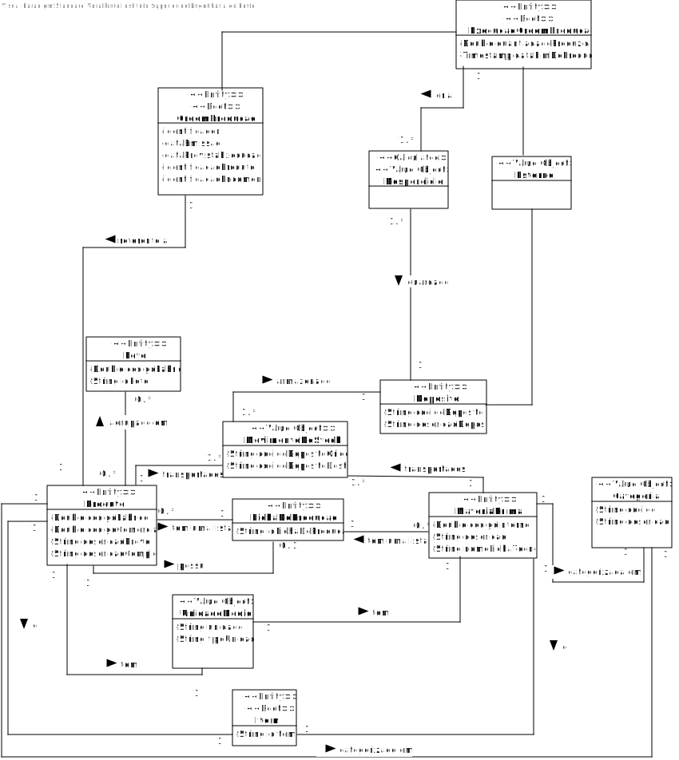
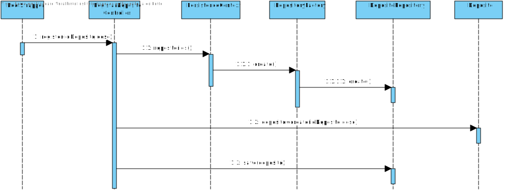
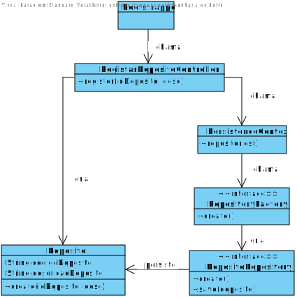

# 1009 -Inicialização de Depósitos
=======================================

# 1. Requisitos

**Descrição:** Como **Gestor de Projeto**, eu pretendo que a equipa proceda à inicialização (bootstrap) de alguns de depósitos.

**Fluxo Principal**
* O Gestor de Projeto deve estar logado no sistema.
* O Gestor de Projeto deve introduzir os dados necessários de uma linha de produção.
* O sistema irá posteriormente validar os dados introduzidos e solicitar confirmação.
* No final, o Gestor de Projeto confirma os dados anteriormente introduzidos.

A interpretação feita deste requisito foi no sentido de de respeitar as seguintes condições:
* Um depósito é caracterizado por: um código identificador e uma descrição.

**Regras de Negócio**
* O código identificador deve ser único.

# 2. Análise

# 3. Design

Esta funcionalidade não é um verdadeiro UC por isso não será implementada uma UI, será invocada através da aplicação Bootstarpapp que guardará num repositório as categorias de matérias-primas atualmente identificadas.

## 3.1. Realização da Funcionalidade

## 3.2. Diagrama de Classes

## 3.3. Padrões Aplicados

| **Questão: Que classe...**       | **Resposta**                       | **Justificação**                                         |
|----------------------------------|------------------------------------|----------------------------------------------------------|
| ...coordena o UC?                | RegistarDepositosController | Controller                                               |
| ...cria/instancia Depositos? | RegistarDepositosController | Creator                                                  |
| ...persiste Deposito?       | DepositoRepository                  | Repository.       |

## 3.4. Testes
*Nesta secção deve sistematizar como os testes foram concebidos para permitir uma correta aferição da satisfação dos requisitos.*

**Teste 1:** Verificar que não é possível criar uma instância da classe Deposito com valores nulos.

	@Test(expected = IllegalArgumentException.class)
		public void ensureNullIsNotAllowed() {
		Deposito instance = new Deposito(null, null);
		}

*Para se criar uma instância deposito é necessário que todos os seus atributos não sejam nulos, logo também irão ser feitos testes individuais (a cada atributo) que seguem a mesma lógica, não sendo necessário menciona-los todos aqui.*

**Teste 2:** Verificar que não é possível criar uma instância da classe Deposito com um valor de codigoDeposito já existente.

	@Test(expected = IllegalArgumentException.class)
    	public void ensureRepeatedIsNotAllowed() {
		Deposito d1 = new Deposito("D001","deposito de cortiça");
    	Deposito instance = new Deposito("D001","deposito de cortiça");
		}

*Para se criar uma instância Deposito, o codigo do deposito tem de ser unico.*

# 4. Implementação

Neste caso de uso, nós iremos fazer o bootstrap dos depositos. Começamos por usar um metodo de register, chamado pela classe "DepositoBootstrapper", que irá passar como pârametros os atributos de um deposito (i.e. codigoDeposito e descricao). Este método irá pertencer á classe RegistarDepositoController. De seguida, cria novos depositos e adiciona á base de dados (Através do DepositoRepository)

# 5. Integração/Demonstração

## Antes de rodar o programa

## Depois de rodar o programa

# 6. Observações

*Nesta secção sugere-se que a equipa apresente uma perspetiva critica sobre o trabalho desenvolvido apontando, por exemplo, outras alternativas e ou trabalhos futuros relacionados.*
