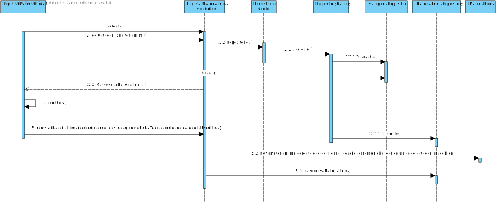
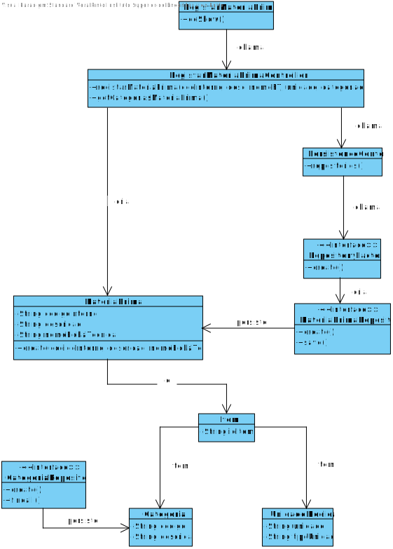

# 2001 - Adicionar Matéria-prima ao Catálogo
=======================================

# 1. Requisitos

**Descrição:** Como **Gestor de Produção**, eu pretendo definir uma nova matéria-prima.

**Fluxo Principal**
* O Gestor de Projeto deve estar logado no sistema.
* O Gestor de Projeto deve introduzir os dados necessários de uma matéria-prima.
* O sistema irá posteriormente validar os dados introduzidos e solicitar confirmação.
* No final, o Gestor de Projeto confirma os dados anteriormente introduzidos.

A interpretação feita deste requisito foi no sentido de respeitar as seguintes condições:

* Uma matéria-prima é caracterizada por: código interno e uma descrição.

# 2. Análise

**Q:** Uma matéria-prima caracteriza-se essencialmente por um código interno, uma descrição, uma categoria e uma ficha técnica (documento pdf).
Existe alguma regra de negócio específica para este documento pdf. Por exemplo, é só referido o nome do documento, o caminho deste, um url, etc.?
**R:** É indicado pelo utilizador qual é o ficheiro (nome e path) e o sistema deve guardar o ficheiro de forma a, se for necessário, posteriormente indicar qual é e mostra-lo ao utilizador.

# 3. Design

*Nesta secção a equipa deve descrever o design adotado para satisfazer a funcionalidade. Entre outros, a equipa deve apresentar diagrama(s) de realização da funcionalidade, diagrama(s) de classes, identificação de padrões aplicados e quais foram os principais testes especificados para validar a funcionalidade.*

*Para além das secções sugeridas, podem ser incluídas outras.*

## 3.1. Realização da Funcionalidade

## 3.2. Diagrama de Classes

## 3.3. Padrões Aplicados

| **Questão: Que classe...**       | **Resposta**                       | **Justificação**                                         |
|----------------------------------|------------------------------------|----------------------------------------------------------|
| ...interage com o utilizador?    | RegistarMateriaPrimaUI         | Pure Fabrication                                         |
| ...coordena o UC?                | RegistarMateriaPrimaController | Controller                                               |
| ...cria/instancia MateriaPrima? | RegistarMateriaPrimaController | Creator                                                  |
| ...persiste MateriaPrima?       | MateriaPrimaRepository                  | Repository.      |

## 3.4. Testes
*Nesta secção deve sistematizar como os testes foram concebidos para permitir uma correta aferição da satisfação dos requisitos.*

**Teste 1:** Verificar que não é possível criar uma instância da classe MateriaPrima com valores nulos.

	@Test(expected = IllegalArgumentException.class)
		public void ensureNullIsNotAllowed() {
		MateriaPrima instance = new MateriaPrima(null, null, null);
	}

*Para se criar uma instância MateriaPrima é necessário que todos os seus atributos não sejam nulos, logo também irão ser feitos testes individuais (a cada atributo) que seguem a mesma lógica, não sendo necessário menciona-los todos aqui.*

**Teste 2:** Verificar que não é possível criar uma instância da classe MateriaPrima com um valor de codigoInterno já existente.

	@Test(expected = IllegalArgumentException.class)
    	public void ensureRepeatedIsNotAllowed() {
		MateriaPrima mp1 = new MateriaPrima("MP001","cortiça","FichaTecnicaCortiça");
    	MateriaPrima instance = new MateriaPrima("MP001","seda","FichaTecnicaSeda");
		}

*Para se criar uma instância MateriaPrima, o codigo interno tem de ser unico.*

# 4. Implementação

Neste caso de uso, nós iremos adicionar matérias-primas. Começamos por chamar o método execute, presente na classe

# 5. Integração/Demonstração

A Demonstração foi feita no US de inicialização de matérias primas.

# 6. Observações

*Nesta secção sugere-se que a equipa apresente uma perspetiva critica sobre o trabalho desenvolvido apontando, por exemplo, outras alternativas e ou trabalhos futuros relacionados.*
