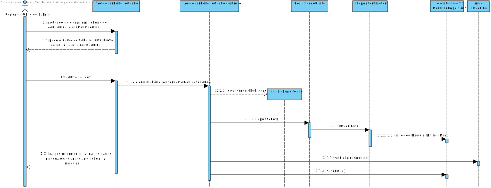
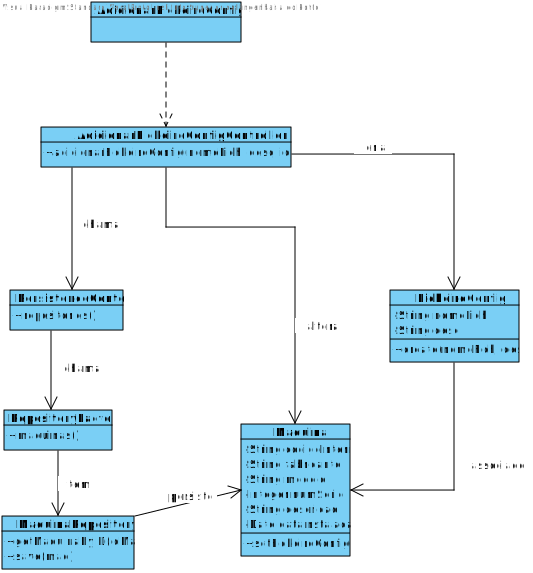

# 3004 - Associar um ficheiro de configuração a uma máquina
=======================================

# 1. Requisitos

**Descrição**: Como **Gestor de Chão de Fábrica** , eu pretendo associar um ficheiro de configuração a uma máquina.

**Fluxo Principal**
* O Gestor de Chão de Fábrica deve estar logado no sistema.
* O Gestor de Chão de Fábrica pretende associar um ficheiro de configuração a uma máquina.
* O sistema pede o path do ficheiro, uma breve descrição e o id da máquina.
* O Gestor de Chão de Fábrica introduz os dados.
* O sistema irá posteriormente validar os dados introduzidos e associar o ficheiro à máquina.

A interpretação feita deste requisito foi no sentido de respeitar as seguintes condições:

* Conseguir adicionar vários ficheiros de configuração a diversas máquinas.

**Regras de negócio**

* Uma máquina possui um código interno, um número de série, uma descrição, uma data de instalação, uma marca e modelo.
  - Outros atributos correlacionados com o protocolo de comunicação podem ser necessários, em particular, a existência de um outro identificador especificado pelo protocolo.
  - Deve existir a possibilidade de associar à máquina um ou mais ficheiros de configuração complementados com uma breve descrição. A edição/manutenção do conteúdo destes ficheiros é realizada fora do âmbito do sistema a desenvolve.

# 2. Análise

* A partir da análise do modelo de domínio atual, conclui-se que o mesmo satisfaz as condições exigidas pelo UC.

**Questões em aberto**
* Qual a frequência deste UC?

# 3. Design

## 3.1. Realização da Funcionalidade

## 3.2. Diagrama de Classes

## 3.3. Padrões Aplicados

| **Questão: Que classe...**       | **Resposta**                       | **Justificação**                                         |
|----------------------------------|------------------------------------|----------------------------------------------------------|
| ...interage com o utilizador?    | AdicionarFicheiroConfigUI                  | Pure Fabrication                                         |
| ...coordena o UC?                | AdicionarFicheiroConfigController          | Controller                                               |
|...persiste maquinas?|MaquinaRepository|Repository|
|..cria a instancia de ficheiro de configuração?|AdicionarFicheiroConfigController|Creator|

## 3.4. Testes
*Nesta secção deve sistematizar como os testes foram concebidos para permitir uma correta aferição da satisfação dos requisitos.*

**Teste 1:** Verificar que não é possível criar uma instância da classe FicheiroConfig com path nulo.

`   @Test(expected = IllegalArgumentException.class)
      public void ensureNullPathIsNotAllowed() {
      FicheiroConfig instance = new FicheiroConfig(null, "XXXX");
   }`
**Teste 2:** Verificar que não é possível criar uma instância da classe FicheiroConfig com descrição nula.

`   @Test(expected = IllegalArgumentException.class)
         public void ensureNullDescricaoIsNotAllowed() {
         FicheiroConfig instance = new FicheiroConfig("XXXX",null);
    }`

# 4. Implementação

Este Use Case foi implementado em Java. O sistema pede ao utilizador o path, descrição e id. Cria a instancia de ficheiro e vai buscar a máquina a base de dados e associa o ficheiro à maquina.

# 5. Integração/Demonstração

*Nesta secção a equipa deve descrever os esforços realizados no sentido de integrar a funcionalidade desenvolvida com as restantes funcionalidades do sistema.*

Antes

Depois

# 6. Observações

*Nesta secção sugere-se que a equipa apresente uma perspetiva critica sobre o trabalho desenvolvido apontando, por exemplo, outras alternativas e ou trabalhos futuros relacionados.*
