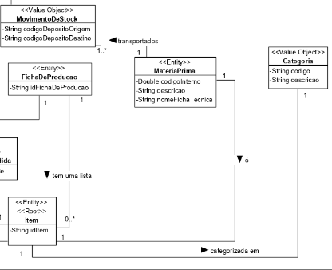

# US 1004 - Inicialização de matérias-primas
=======================================

# 1. Requisitos

**Descrição** Como Gestor de Projeto, eu pretendo que a equipa proceda à inicialização (bootstrap) de algumas matérias-primas.

**Fluxo principal**
* O sistema, contendo os dados, inicializa as instâncias de matéria-prima.

A interpretação e regras de negócio encontram-se explícitas no UC 2001 - Adicionar Matéria-Prima ao Catálogo.

# 2. Análise

O modelo de domínio dá resposta aos requisitos deste caso de uso e não há necessidade de o estender.

# 3. Design

Utilizámos a estrutura base standard da aplicação baseada em camadas.

## 3.1. Realização da Funcionalidade

Esta funcionalidade não é um verdadeiro UC por isso não será implementada uma UI, será invocada através da classe **MateriaPrimaBootstrapper** que guardará num repositório as matérias-primas atualmente identificadas.

* A funcionalidade encontra-se dentro de um loop. Ou seja, o método register da bootstrap é executado n vezes, sendo n o número de instâncias a serem inicializadas.

## 3.2. Diagrama de Classes

O diagrama de classes segue a mesma estrutura do diagrama do UC 2001 - Adicionar Matéria-Prima ao Catálogo. Como referido anteriormente, não será implementada uma UI, pelo que, no diagrama, ela é substituída pela classe **MateriaPrimaBootstrapper**. A cardinalidade também é mantida.

## 3.3. Padrões Aplicados

As questões, respostas e respetivas justificações (padrões) relativas ao caso de uso encontram-se descritas no UC 2001 - Adicionar Matéria-Prima ao Catálogo. A única diferença reside na questão relativa a qual classe interage com o utilizador. Uma vez que o mesmo não existe, essa questão seria cortada deste UC.

## 3.4. Testes 

Sendo um UC de bootstrap e que, portanto, usa classes de domínio, no caso, do UC 2001 - Adicionar Matéria-Prima ao Catálogo, eles não serão representados aqui.

# 4. Implementação

*Nesta secção a equipa deve providenciar, se necessário, algumas evidências de que a implementação está em conformidade com o design efetuado. Para além disso, deve mencionar/descrever a existência de outros ficheiros (e.g. de configuração) relevantes e destacar commits relevantes;*

*Recomenda-se que organize este conteúdo por subsecções.*

# 5. Integração/Demonstração

*Nesta secção a equipa deve descrever os esforços realizados no sentido de integrar a funcionalidade desenvolvida com as restantes funcionalidades do sistema.*

# 6. Observações

*Nesta secção sugere-se que a equipa apresente uma perspetiva critica sobre o trabalho desenvolvido apontando, por exemplo, outras alternativas e ou trabalhos futuros relacionados.*

