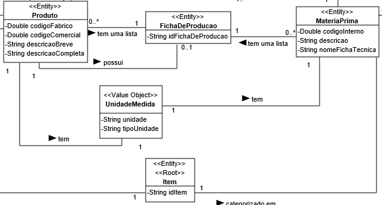
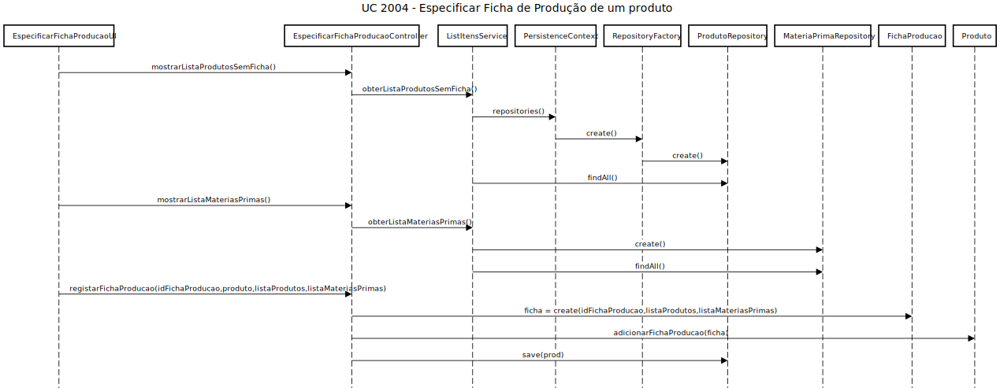
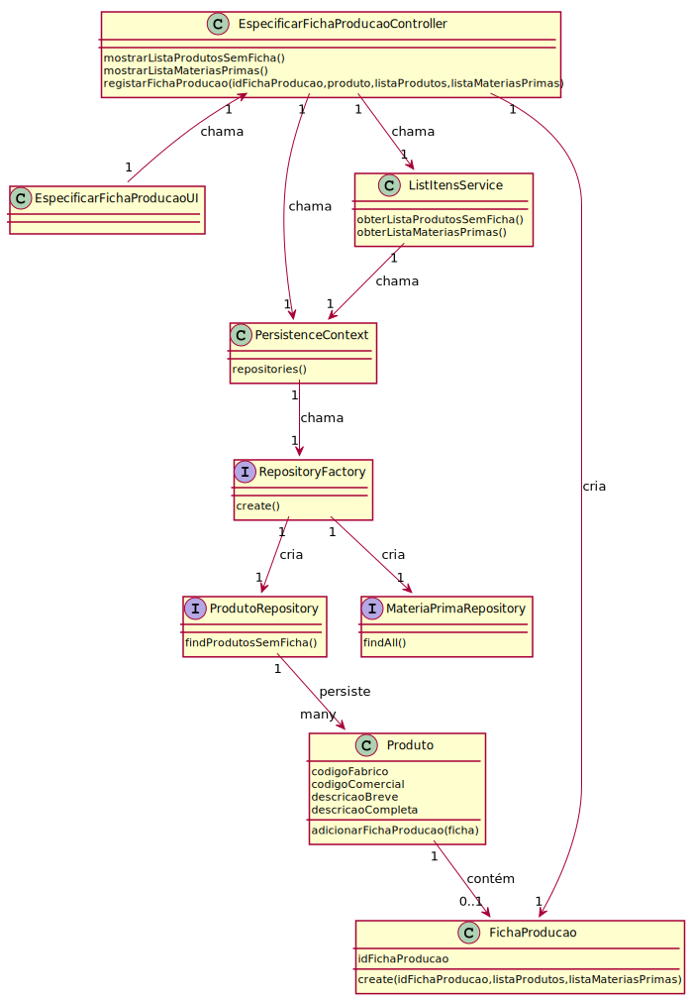

# US 2004 - Especificar Ficha de Produção de um produto
===================================================

# 1. Requisitos

**Descrição** Como Gestor de Produção, eu pretendo especificar a Ficha de Produção de um dado produto.

**Fluxo principal**

* O Gestor de Produção deve estar logado no sistema.
* O GP deverá de escolher, de uma lista de produtos, aquele ao qual irá atribuir a ficha de produção a ser criada.
* Ao GP é apresentada uma lista com produtos e matérias-primas (Itens). O mesmo deverá de selecionar um.
* Para cada um, o GE deverá introduzir a quantidade.
* No final, o GP confirma os dados introduzidos.

A interpretação feita deste requisito foi no sentido de respeitar as seguintes condições:

* Uma ficha de produção é caraterizada por um id, uma lista de matérias-primas e respetivas quantidades e uma lista de produtos e respetivas quantidades.
* Uma ficha de produção é relativa a um produto.

**Regras de negócio**

* A quantidade de cada item deve ser um número maior que zero.
* O produto para o qual foi atribuida a ficha não pode constatar na lista de itens necessárias para a criação do mesmo.
* Os atributos da ficha de produção não podem ser nulos nem vazios.

**Dependências e correlações**

* Este requisito está dependente da inicialização/adição de um produto e de pelo menos um item (produto ou matéria-prima) no sistema, de forma a respeitar as condições exigidas.

# 2. Análise

**Análise do Modelo de Domínio**

A partir da análise do modelo de domínio atual, conclui-se que o mesmo satisfaz as condições exigidas pelo UC

**Questões em aberto**

* Qual a frequência de ocorrência desde caso de uso?

# 3. Design

## 3.1. Realização da Funcionalidade

O fluxo/sequência que permite realizar a funcionalidade encontra-se descrito no seguinte diagrama de sequência:

## 3.2. Diagrama de Classes

As principais classes envolvidas na realização desta funcionalidade encontram-se descritas no seguinte diagrama:

## 3.3. Padrões Aplicados

| **Questão: Que classe...**       | **Resposta**                       | **Justificação**                                         |
|----------------------------------|------------------------------------|----------------------------------------------------------|
| ...interage com o utilizador?    | EspecificarFichaProducaoUI         | Pure Fabrication                                         |
| ...coordena o UC?                | EspecificarFichaProducaoController | Controller                                               |
| ...cria/instancia FichaProducao? | EspecificarFichaProducaoController | Creator                                                  |
| ...persiste FichaProducao?       | FichaProducaoRepository            | Repository                                               |
| ...guarda lista de itens?        | FichaProducao                      | Information Expert: FichaProducao contém lista de Itens. |
| ...cria FichaProducaoRepository  | RepositoryFactory                  | Factory                                                  |
| ...cria ProdutoRepository        | RepositoryFactory                  | Factory                                                  |
| ...cria MateriaPrimaRepository   | RepositoryFactory                  | Factory                                                  |

## 3.4. Testes 

**Teste 1:** Verificar que não é possível criar uma instância da classe FichaProducao com o id nulo.

	@Test(expected = IllegalArgumentException.class)
		public void ensureIdFichaProducaoIsNotNull() {
		FichaProducao instance = new FichaProducao(null, XXXX, XXXX);
	}

**Teste 2:** Verificar que não é possível criar uma instância da classe FichaProducao com a lista de produtos nula.

	@Test(expected = IllegalArgumentException.class)
		public void ensureListaProdutosIsNotNull() {
		FichaProducao instance = new FichaProducao(XXXX, null, XXXX);
	}

**Teste 3:** Verificar que não é possível criar uma instância da classe FichaProducao com a lista de matérias-primas nula.

	@Test(expected = IllegalArgumentException.class)
		public void ensureListaMateriasPrimasIsNotNull() {
		FichaProducao instance = new FichaProducao(XXXX, XXXX, null);
	}

**Nota:** Os testes realizados anteriormente também são válidos para verificar se os atributos não são vazios.

**Teste 4:** Verificar que não é possível criar uma instância da classe FichaProducao com a lista de produtos com quantidade negativa.

	@Test(expected = IllegalArgumentException.class)
		public void ensureListaProdutosQuantidadeIsNotNegative() {
                Produto instance = new Produto(XXXX, XXXX, XXXX, XXXX, XXXX, XXXX);
	        Map<Produto, Integer> listaProdutos = new HashMap<>();
                listaProdutos.put(instance,-1);
		FichaProducao instance1 = new FichaProducao(XXXX, listaProdutos, XXXX);
	}

**Teste 5:** Verificar que não é possível criar uma instância da classe FichaProducao com a lista de matérias-primas com quantidade negativa.

	@Test(expected = IllegalArgumentException.class)
		public void ensureListaMateriasPrimasQuantidadeIsNotNegative() {
                MateriaPrima instance = new MateriaPrima(XXXX, XXXX, XXXX, XXXX, XXXX);
	        Map<MateriaPrima, Integer> listaMateriasPrimas = new HashMap<>();
                listaMateriasPrimas.put(instance,-1);
		FichaProducao instance1 = new FichaProducao(XXXX, XXXX, listaMateriasPrimas);
	}

**Teste 6:** Verificar que não é possível adicionar ao produto uma ficha de produção com esse mesmo produto inserido na lista de produtos da ficha.

	@Test(expected = IllegalArgumentException.class)
		public void ensureProdutoNotPresentInListaProdutos() {
                Produto instance = new Produto(XXXX, XXXX, XXXX, XXXX, XXXX, XXXX);
	        Map<Produto, Integer> listaProdutos = new HashMap<>();
                listaProdutos.put(instance,20);
		FichaProducao instance1 = new FichaProducao(XXXX, XXXX, listaProdutos, XXXX);
                instance.adicionarFichaProducao(instance1);
	}

**Nota:** Todos os testes vão ser implementados na classe FichaProducaoTest, excepto o Teste 6, que será implementado na classe ProdutoTest.

# 4. Implementação

* Implementámos a classe **ListItensService**, de forma a evitar duplicação de código, uma vez que os métodos implementados na mesma podem ser usados por outras classes.

# 5. Integração/Demonstração

*Nesta secção a equipa deve descrever os esforços realizados no sentido de integrar a funcionalidade desenvolvida com as restantes funcionalidades do sistema.*

# 6. Observações

*Nesta secção sugere-se que a equipa apresente uma perspetiva critica sobre o trabalho desenvolvido apontando, por exemplo, outras alternativas e ou trabalhos futuros relacionados.*

