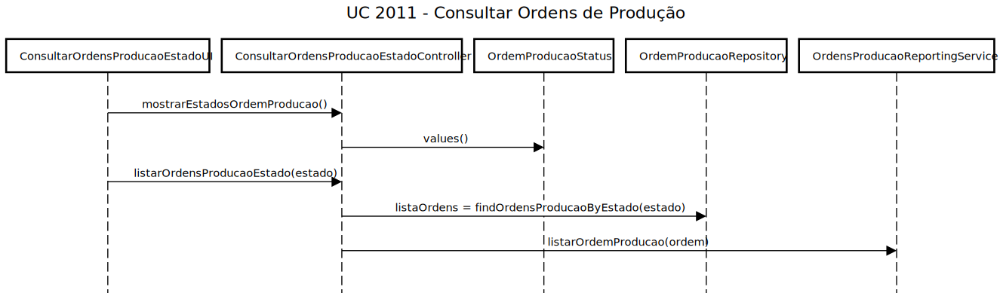
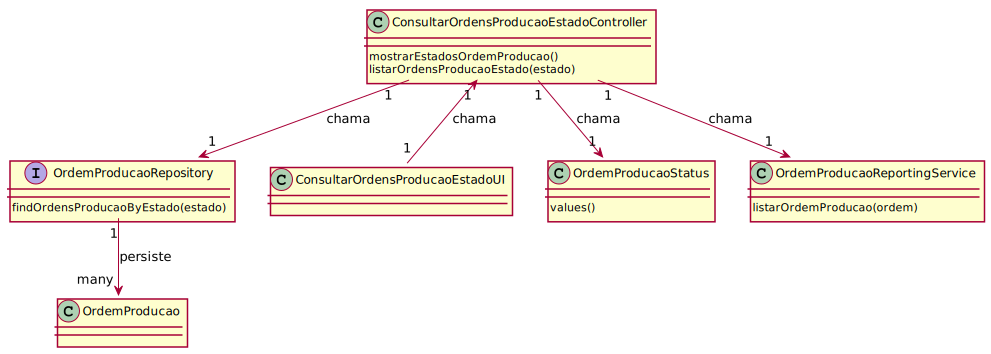
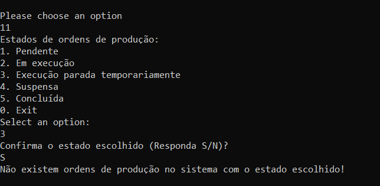
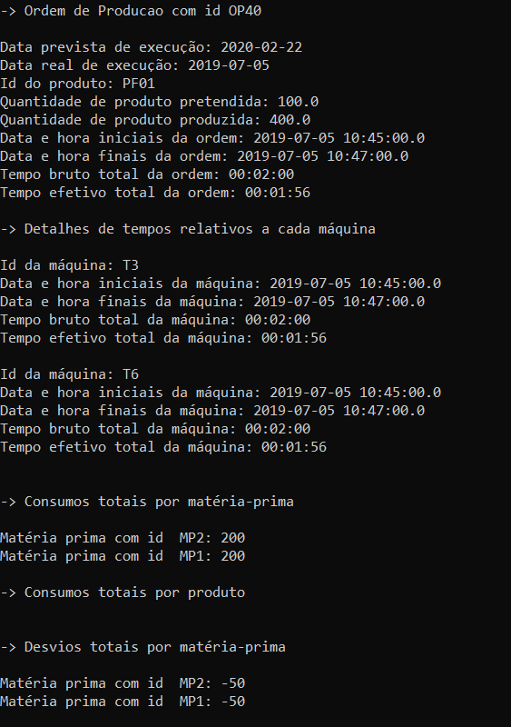
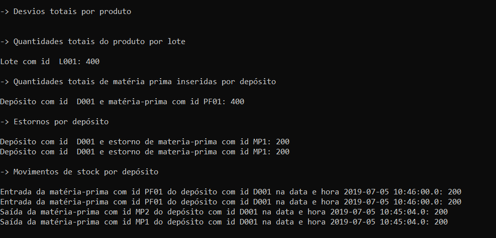

# US 2011 - Consultar Ordens de Produção
===================================================

# 1. Requisitos

**Descrição** Como Gestor de Produção, eu pretendo consultar as ordens de produção que estão num determinado estado (e.g. em execução). Deve permitir consultar o detalhe de cada ordem de produção.

**Fluxo principal**

* O Gestor de Produção deve estar logado no sistema.
* O GP deverá de escolher, de entre uma lista, o estado das ordens de produção que pretende visualizar.
* O GP confirma o estado que escolheu.
* Uma lista das ordens de produção e respetivos detalhes é apresentada para o mesmo.
* Por fim, é perguntado ao GP se pretende sair. Em caso afirmativo, o UC termina.

A interpretação feita deste requisito foi no sentido de respeitar as seguintes condições:

* Os detalhes relativos a uma ordem de produção são os seguintes: id da ordem, data de emissão da mesma, data prevista de execução, id do produto, id da encomenda, quantidade de produto pretendida, quantidade de produto produzida, tempos de execução totais da ordem e de cada máquina (bruto e efetivo), assim como as datas e horas iniciais e finais, consumos e desvios totais para cada matéria-prima e/ou produto usado, quantidade de produto produzida por lote e deposito, estornos e movimentos de stock gerados.
* Se o estado da ordem for pendente, apenas os seguintes detalhes serão mostrados: id da ordem, data prevista de execução, id do produto, id da encomenda e quantidade de produto pretendida.

**Dependências e correlações**

* Para que possam ser mostradas ordens de produção para um determinado estado, essas mesmas ordens têm que se encontram disponíveis no sistema. Tirando os estados pendente, suspensa e execução parada temporariamente, todos os outros surgem após o processamento de mensagens, pelo que existe uma correlação com o UC 5001. Também existe com os UCs 2009/2010 (estado pendente) e UC 3009 (estado suspensa).

# 2. Análise

**Análise do Modelo de Domínio**

Ao analisar o modelo de domínio atual, conclui-se que o mesmo satisfaz as condições exigidas pelo UC.

**Questões em aberto**

* Qual a frequência de ocorrência desde caso de uso?

# 3. Design

**Notas:** 

* As classes PersistenceContext e RepositoryFactory, utilizadas aquando da criação de instâncias de Repository para cada objeto necessário foram excluídas dos diagramas. No entanto, encontram-se, evidentemente, presentes no código.

## 3.1. Realização da Funcionalidade

O fluxo/sequência que permite realizar a funcionalidade encontra-se descrito no seguinte diagrama de sequência:

O método listarOrdemProducao(ordem) é executado para cada ordem de produção presente na lista obtida com o método findOrdensProducaoByEstado(estado).

## 3.2. Diagrama de Classes

As principais classes envolvidas na realização desta funcionalidade encontram-se descritas no seguinte diagrama:

## 3.3. Padrões Aplicados

| **Questão: Que classe...**                      | **Resposta**                               | **Justificação**    |
|-------------------------------------------------|--------------------------------------------|---------------------|
| ...interage com o utilizador?                   | ConsultarOrdensProducaoEstadoUI            | Pure Fabrication    |
| ...coordena o UC?                               | ConsultarOrdensProducaoEstadoController    | Controller          |
| ...lista das ordens de produção?                | OrdensProducaoReportingService             | Information Expert  |
| ...cria OrdemProducaoRepository                 | RepositoryFactory                          | Factory             |

## 3.4. Testes 

**Nota:** Para este UC, não serão realizados testes.

# 4. Implementação

* Foi implementada a classe **OrdemProducaoStatusPrinter**, que é utilizada para listar os estados de ordens de produção definidos no sistema.

# 5. Integração/Demonstração

Foram realizadas demonstrações deste caso de uso. Alguns cenários foram testados, nomeadamente:

* Cenário em que é escolhido um estado em que não existem ordens de produção com esse mesmo estado:

* Cenário em que existe uma ordem de produção com o estado escolhido. O output pode ser visualizado abaixo:

# 6. Observações

Relativamente a este UC, a equipa acredita ter atingido os objetivos, tendo mantido uma boa coerência entre o código e a documentação.

