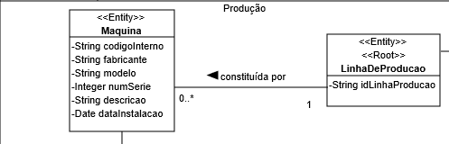
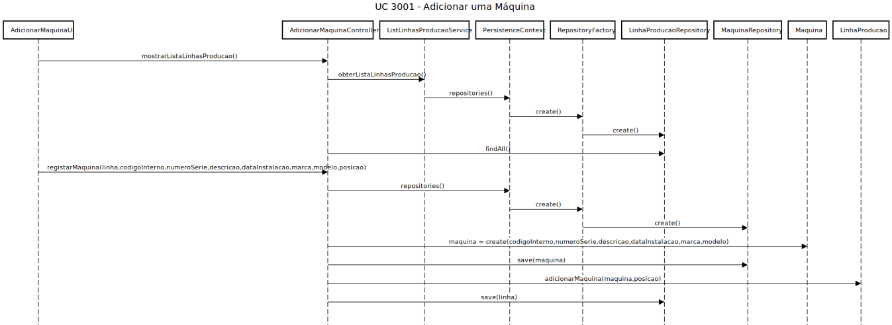
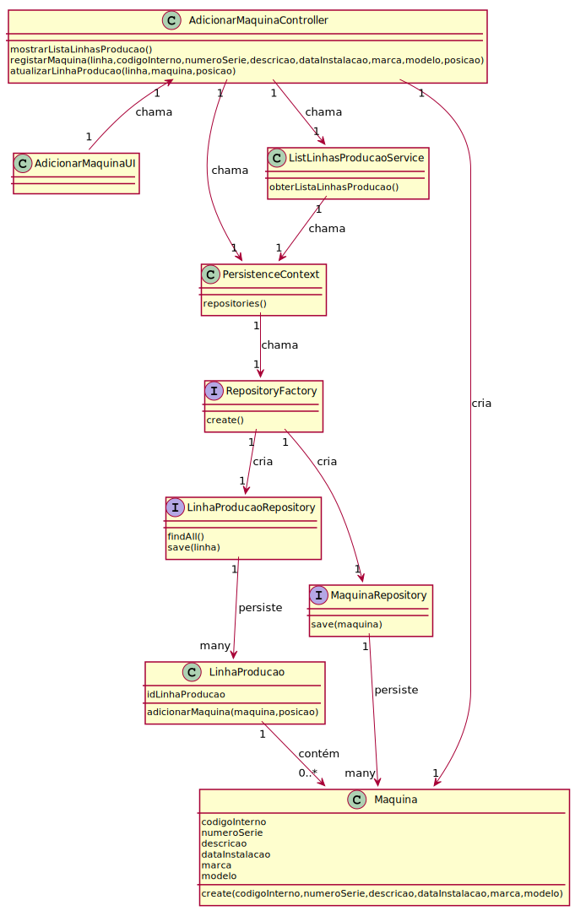

# US 3001 - Adicionar uma Máquina
=======================================

# 1. Requisitos

**Descrição** Como Gestor de Chão de Fábrica, eu pretendo definir a existência de uma nova máquina.

**Fluxo principal**

* O Gestor de Chão de Fábrica deve estar logado no sistema.
* Ao GCF é apresentada uma lista de linhas de produção. O mesmo deverá de escolher uma.
* O GCF deverá de introduzir os dados necessários para a adição de uma máquina ao sistema (dados descritos mais a baixo).
* No final, o GCF confirma os dados introduzidos.

A interpretação feita deste requisito foi no sentido de respeitar as seguintes condições:

* Uma máquina é caraterizada por um código interno, número de série, descrição, data de instalação, marca e modelo.
* Uma máquina só existe no contexto de uma linha de produção.
* Uma máquina, no contexto de uma linha de produção, contém uma posição nessa mesma linha.

**Regras de negócio**

* Nenhum dos atributos de uma máquina pode ser nulo.
* O código interno tem que ser único.
* O número de série tem que ser único.
* A data de instalação não pode ser superior á data de registo no sistema.
* A posição não pode ser igual ou inferior a 0.

**Dependências e correlações**

* Este requisito está dependente da existência de pelo menos uma linha de produção no sistema.

# 2. Análise

**Análise do Modelo de Domínio**

A partir da análise do modelo de domínio atual, conclui-se que o mesmo satisfaz as condições exigidas pelo UC

**Questões em aberto**

* Qual a frequência de ocorrência desde caso de uso?

# 3. Design

Utilizámos a estrutura base standard da aplicação baseada em camadas.

## 3.1. Realização da Funcionalidade

O fluxo/sequência que permite realizar a funcionalidade encontra-se descrito no seguinte diagrama de sequência:

## 3.2. Diagrama de Classes

As principais classes envolvidas na realização desta funcionalidade encontram-se descritas no seguinte diagrama:

## 3.3. Padrões Aplicados

| **Questão: Que classe...**       | **Resposta**                       | **Justificação**                                         |
|----------------------------------|------------------------------------|----------------------------------------------------------|
| ...interage com o utilizador?    | AdicionarMaquinaUI                 | Pure Fabrication                                         |
| ...coordena o UC?                | AdicionarMaquinaController         | Controller                                               |
| ...cria/instancia Maquina?       | AdicionarMaquinaController         | Creator                                                  |
| ...persiste Maquina?             | MaquinaRepository                  | Repository                                               |
| ...cria MaquinaRepository?       | RepositoryFactory                  | Factory                                                  |

## 3.4. Testes

**Teste 1:** Verificar que não é possível criar uma instância da classe Maquina com código interno nulo.

	@Test(expected = IllegalArgumentException.class)
		public void ensureCodigoInternoIsNotNull() {
		Maquina instance = new Maquina(null, XXXX, XXXX, XXXX, XXXX, XXXX);
	}

**Teste 2:** Verificar que não é possível criar uma instância da classe Maquina com número de série nulo.

	@Test(expected = IllegalArgumentException.class)
		public void ensureNumeroSerieIsNotNull() {
		Maquina instance = new Maquina(XXXX, null, XXXX, XXXX, XXXX, XXXX);
	}

**Teste 3:** Verificar que não é possível criar uma instância da classe Maquina com descrição nula.

	@Test(expected = IllegalArgumentException.class)
		public void ensureDescricaoIsNotNull() {
		Maquina instance = new Maquina(XXXX, XXXX, null, XXXX, XXXX, XXXX);
	}

**Teste 4:** Verificar que não é possível criar uma instância da classe Maquina com data de instalação nula.

	@Test(expected = IllegalArgumentException.class)
		public void ensureDataInstalacaoIsNotNull() {
		Maquina instance = new Maquina(XXXX, XXXX, XXXX, null, XXXX, XXXX);
	}

**Teste 5:** Verificar que não é possível criar uma instância da classe Maquina com marca nula.

	@Test(expected = IllegalArgumentException.class)
		public void ensureMarcaIsNotNull() {
		Maquina instance = new Maquina(XXXX, XXXX, XXXX, XXXX, null, XXXX);
	}

**Teste 6:** Verificar que não é possível criar uma instância da classe Maquina com modelo nulo.

	@Test(expected = IllegalArgumentException.class)
		public void ensureModeloIsNotNull() {
		Maquina instance = new Maquina(XXXX, XXXX, XXXX, XXXX, XXXX, null);
	}

**Nota:** Os testes realizados anteriormente também são válidos para verificar se os atributos não são vazios (exceto DataInstalacao).

**Teste 7:** Verificar que não é possível criar instâncias da classe Maquina com dataInstalacao superior à data do sistema.

	@Test(expected = IllegalArgumentException.class)
		public void ensureMaquinaDontHaveFutureDataInstalacao() {
	        LocalDate now = LocalDate.now();
		int ano = now.getYear() + 1;
		Maquina instance = new Maquina(XXXX, XXXX, XXXX, LocalDate.of(ano,now.getMonthValue(),now.getDayOfMonth()), XXXX, XXXX);
	}

**Teste 8:** Verificar que não é possível adicionar uma máquina a uma linha com a posição igual a 0.

	@Test(expected = IndexOutOfBoundsException.class)
		public void ensurePosicaoIsNotEqualToZero() {
	        LinhaProducao instance = new LinhaProducao(XXXX);
		Maquina instance1 = new Maquina(XXXX, XXXX, XXXX, XXXX, XXXX, XXXX);
                instance.adicionarMaquina(instance1,0);
	}

**Teste 9:** Verificar que não é possível adicionar uma máquina a uma linha com a posição inferior a 0.

	@Test(expected = IndexOutOfBoundsException.class)
		public void ensurePosicaoIsNotInferiorToZero() {
	        LinhaProducao instance = new LinhaProducao(XXXX);
		Maquina instance1 = new Maquina(XXXX, XXXX, XXXX, XXXX, XXXX, XXXX);
                instance.adicionarMaquina(instance1,-1);
	}

**Nota:** Todos os testes vão ser implementados na classe MaquinaTest, exceto os dois últimos, que será implementado na classe LinhaProducaoTest.

# 4. Implementação

* Implementámos a classe **ListLinhasProducaoService**, de forma a evitar duplicação de código, uma vez que os métodos implementados na mesma podem ser usados por outras classes.

# 5. Integração/Demonstração

*Nesta secção a equipa deve descrever os esforços realizados no sentido de integrar a funcionalidade desenvolvida com as restantes funcionalidades do sistema.*

# 6. Observações

*Nesta secção sugere-se que a equipa apresente uma perspetiva critica sobre o trabalho desenvolvido apontando, por exemplo, outras alternativas e ou trabalhos futuros relacionados.*

