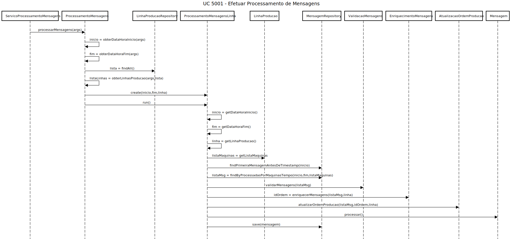
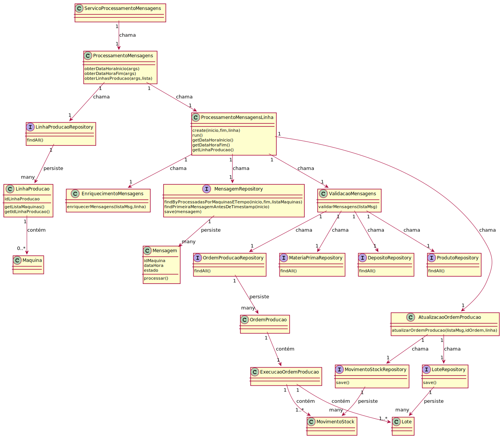
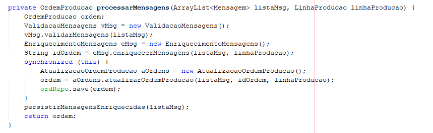
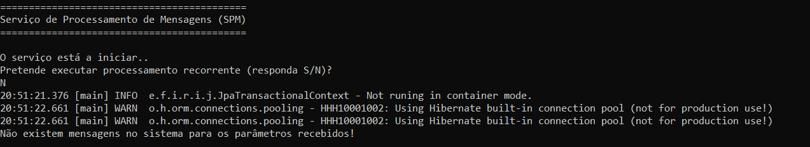
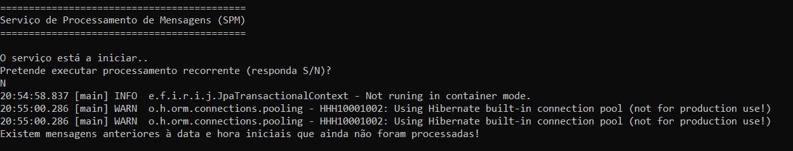
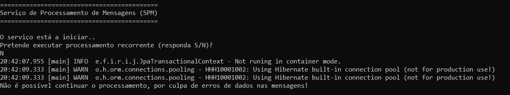
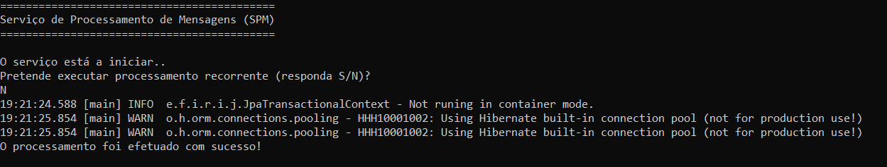

# US 5001 - Efetuar Processamento de Mensagens
===================================================

# 1. Requisitos

**Descrição** Como Serviço de Processamento de Mensagens (SPM), pretendo efetuar o processamento das mensagens disponíveis no sistema.

**Fluxo principal**

* O Serviço de Processamento de Mensagens (SPM) deve se encontrar no sistema.
* Um utilizador executa o serviço, escolhendo processar as mensagens através de intervalos de tempo, passando por parâmetro um intervalo de tempo e 0 ou mais linhas de produção a serem processadas.
* O SPM pega num conjunto de mensagens ainda não processadas, cuja data se encontra inserida no intervalo de tempo passado por parâmetro e cuja máquina se encontre inserida na(s) linha(s) passada(s), também, por parâmetro.
* O serviço inicia o processo de validação dessas mesmas mensagens. No caso, verifica se os elementos que constituem as mensagens fazem parte do sistema. Se não fizerem, são geradas notificações de erro para posterior reajuste e o processamento termina.
* Num segundo processo, o serviço inicia o enriquecimento das mensagens, complementando-as com a linha de produção em que a máquina se encontra e a ordem de produção correspondente, caso não tenham estes dados.
* Num terceiro e último processo, o serviço gera/atualiza os dados presentes na ordem de produção onde as mensagens foram geradas, tais como consumos, desvios, tempo bruto, tempo efetivo, lotes, itens e estornos e respetivas quantidades mandadas para depósitos, linha de produção, máquinas correspondentes à linha e respetivos detalhes de tempo, tanto efetivo como bruto, e movimentos de stock.
* Por fim, o serviço atualiza as mensagens na base de dados e termina.

A interpretação feita deste requisito foi no sentido de respeitar as seguintes condições:

* O processamento de mensagens é executado de forma paralela/concorrente, por linha de produção.
* O processamento só é realizado para mensagens que ainda não tenham sido processadas.
* O processamento de um bloco não é realizado caso existam mensagens por processar que sejam anteriores à data e hora de início introduzidas.
* Uma mensagem pode ser de vários tipos, e todas são constituídas por um id único, o id da máquina que a gerou, a data e hora a que foi gerada, um estado que indica se a mesma já foi processada ou não, um id da linha de produção (opcional) e um id da ordem de produção correspondente (opcional).
* O estado da ordem de produção pode ser modificado. Se a primeira mensagem da primeira máquina da linha estiver presente, o estado é modificado para "em execução". Se a última mensagem da última máquina da linha estiver presente, então o estado é modificado para "concluida".

**Regras de negócio**

* A ordem dos parâmetros é dataHoraInicio, dataHoraFim e linhas de produção.
* Poderá não ser passada nenhuma linha de produção por parâmetro. Caso isso aconteça, considera-se, por omissão, todas as linhas.
* É obrigatório passar um intervalo de tempo por parâmetro. Se não for passado nenhum, o sistema termina.
* A data e hora correspondentes ao final devem ser maiores do que a data e hora correspondentes ao início do processamento.

**Dependências e correlações**

* Este requisito está dependente da presença de mensagens na base de dados. Tanto o UC 4001 como o 4002 são responsáveis por persistir mensagens. Também é necessário que uma ordem de produção esteja ativa na(s) linha(s) de produção escolhida(s).

# 2. Análise

**Análise do Modelo de Domínio**

Ao analisar o modelo de domínio atual, conclui-se que o mesmo satisfaz as condições exigidas pelo UC.

**Questões em aberto**

* Qual a frequência de ocorrência desde caso de uso?

# 3. Design

**Notas:** 

* As classes PersistenceContext e RepositoryFactory, utilizadas aquando da criação de instâncias de Repository para cada objeto necessário foram excluídas dos diagramas. No entanto, encontram-se, evidentemente, presentes no código.

* A geração de notificações de erros de processamento não se encontra explícita nos diagramas, pelo que as classes NotificacaoErroProcessamento e NotificacaoErroRepository não se encontram representadas. No entanto, as mesma (geração) ocorre ao nível da classe ValidacaoMensagens, no caso de algum erro ser detetado.

* Os métodos setOrdemProducao e setLinhaProducao, da classe Mensagem, também não se encontram representados nos diagramas. Os mesmos serão usados para modificar dados de algumas mensagens analisadas na classe EnriquecimentoMensagens.

## 3.1. Realização da Funcionalidade

O fluxo/sequência que permite realizar a funcionalidade encontra-se descrito no seguinte diagrama de sequência:

O método run é executado para cada Thread criada. As Threads são criadas num ciclo for, que também contém, para além do método referido anteriormente, o método create da classe ProcessamentoMensagensLinha e o método get de uma lista de linhas, para atribuir a cada Thread uma linha de produção.
O método findFirstMessageBeforeTimestamp permite obter a última mensagem antes da data e hora de inicio introduzidas, de forma a saber se existem mensagens ainda por processar anteriores a esses dados.
Os métodos save(), do repositório de Mensagem, e processar(), da classe Mensagem, são executados para cada mensagem presente na listaMsg.
A classe ValidacaoMensagens chama os métodos findAll() das seguintes: ProdutoRepository, DepositoRepository, OrdemProducaoRepository e MateriaPrimaRepository.
A classe AtualizacaoOrdemProducao cria instâncias de Lote e MovimentoStock, que são persistidas na base e adicionadas à classe ExecucaoOrdemProducao. Já os depósitos apenas são adicionados a essa mesma classe, uma vez que já se devem encontrar no sistema.

## 3.2. Diagrama de Classes

As principais classes envolvidas na realização desta funcionalidade encontram-se descritas no seguinte diagrama:

## 3.3. Padrões Aplicados

| **Questão: Que classe...**                      | **Resposta**                               | **Justificação**    |
|-------------------------------------------------|--------------------------------------------|---------------------|
| ...coordena o UC?                               | ProcessamentoMensagens                     | Controller          |
| ...valida os dados passados por parâmetro?      | ProcessamentoMensagens                     | Information Expert  |
| ...cria/instancia NotificacaoErroProcessamento? | ValidacaoMensagens/EnriquecimentoMensagens | Creator             |
| ...modifica o estado de Mensagem?               | Mensagem                                   | Information Expert  |
| ...persiste FichaProducao?                      | FichaProducaoRepository                    | Repository          |
| ...persiste Mensagem?                           | MensagemRepository                         | Repository          |
| ...persiste NotificacaoErroProcessamento?       | NotificacaoErroRepository                  | Repository          |
| ...persiste Lote?                               | LoteRepository                             | Repository          |
| ...persiste MovimentoStock?                     | MovimentoStockRepository                   | Repository          |
| ...cria/instancia Lote?                         | AtualizarOrdemProducao                     | Creator             |
| ...cria/instancia MovimentoStock?               | AtualizarOrdemProducao                     | Creator             |
| ...cria LinhaProducaoRepository                 | RepositoryFactory                          | Factory             |

**Nota:** À questão: "Que classe cria XXXXRepository, todas as classes Repository presentes nos diagramas possuem a mesma resposta e justificação.

## 3.4. Testes 

**Teste 1:** Verificar que não é possível o serviço aceitar uma dataHora inicio superior a uma dataHora fim.

	@Test(expected = IllegalArgumentException.class)
		public void ensureDataHoraInicioIsNotSuperiorThenDataHoraFim() {
		String[] argumentos = new String[2];
		argumentos[0] = XXXX+1 (one timestamp);
		argumentos[1] = XXXX (one timestamp);
 		ProcessamentoMensagens processamento = new ProcessamentoMensagens();
        processamento.processarMensagens(argumentos);
	}

**Teste 2:** Verificar que não é possível o serviço aceitar apenas 1 instância de tempo

	@Test(expected = ArrayIndexOutOfBoundsException.class)
		public void ensureOneTimestampIsPresent() {
	    String[] argumentos = new String[1];
		argumentos[1] = XXXX (one timestamp)
 		ProcessamentoMensagens processamento = new ProcessamentoMensagens();
        processamento.processarMensagens(argumentos);
	}

**Teste 3:** Verificar que não é possível o serviço aceitar sem nenhum intervalo de tempo.

	@Test(expected = ArrayIndexOutOfBoundsException.class)
		public void ensureAtLeastOneTimestampIsPresent() {
		String[] argumentos = new String[0];
 		ProcessamentoMensagens processamento = new ProcessamentoMensagens();
        processamento.processarMensagens(argumentos);
    }

**Teste 4:** Verificar que não é possível o serviço aceitar 1 instância de tempo não numérica.

	@Test(expected = NumberFormatException.class)
		public void ensureTimestampIsNumber() {
		String[] argumentos = new String[1];
		argumentos[0] = "fff";
        ProcessamentoMensagens processamento = new ProcessamentoMensagens();
        processamento.processarMensagens(argumentos);
	}

**Teste 5:** Verificar que não é possível o serviço aceitar 1 instância de tempo inválida (com instância numérica, mas mal escrita).

	@Test(expected = ArrayIndexOutOfBoundsException.class)
		public void ensureTimestampIsValid() {
		String[] argumentos = new String[1];
		argumentos[0] = "201906";
        ProcessamentoMensagens processamento = new ProcessamentoMensagens();
        processamento.processarMensagens(argumentos);
	}

**Nota:** Todos os testes supracitados vão ser implementados na classe ProcessamentoMensagensTest.

# 4. Implementação

* Foi implementada a classe **Utils**, de forma a que os métodos que se encontram presentes na mesma podessem ser reutilizados futuramente.

* Foi implementada a classe **CriacaoNotificacoesErroService**, cuja função é criar instâncias de notificações de erro.

* Foi implementada a classe **ValidacaoMensagensConstants**, de forma a criar constantes genéricas que seriam usadas para a criação de notificações de erro.

* Da implementação, destaca-se o uso de um mecanismo de sincronização para que cada Thread (para cada linha) persista uma ordem de produção na base de cada vez, para que não pudessem ocorrer conflitos entre as mesmas. Este mecanismo encontra-se implementado na classe **ProcessamentoMensagensLinha**.

# 5. Integração/Demonstração

Foram realizadas demonstrações deste caso de uso. Alguns cenários foram testados, nomeadamente:

* Cenário em que não existem mensagens na base de dados para o intervalo de tempo especificado:

* Cenário em que existem mensagens na base anteriores à data e hora iniciais que ainda não foram processadas:

* Cenário em que são detetados erros nas mensagens ao nível da validação das mesmas (ausência de instâncias na base):

* Cenário de sucesso, em que todas as mensagens inseridas no intervalo de tempo especificado são processadas:

# 6. Observações

Relativamente ao UC, acreditamos que não esteja perfeito, mas o grupo considera que respondeu bem aos requisitos exigidos.

