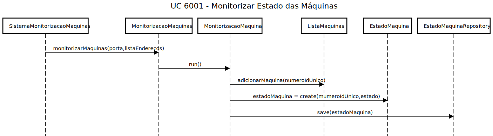
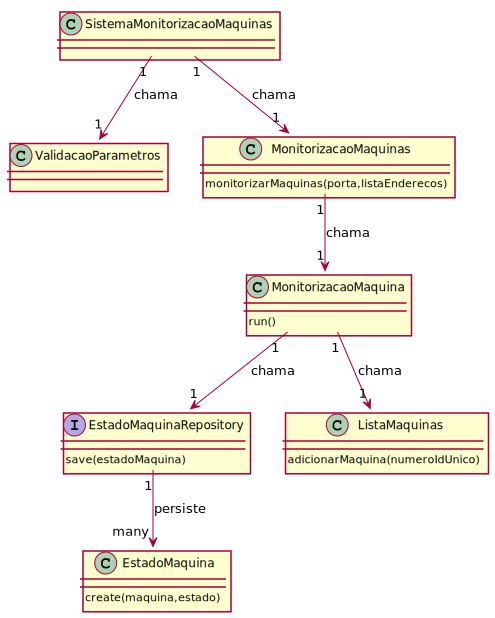
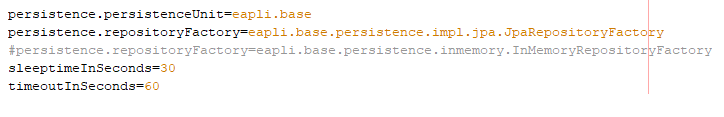
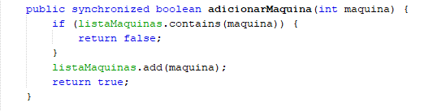
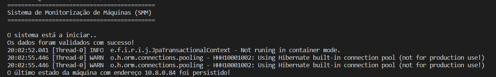
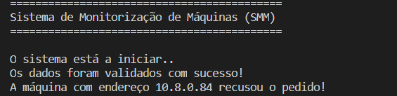
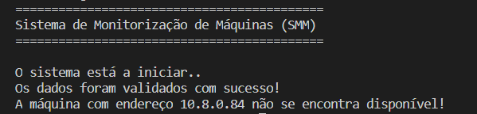

# US 6001 - Monitorizar Estado das Máquinas
=============================================

# 1. Requisitos

**Descrição** Como Sistema de Monitorização das Máquinas (SMM), pretendo monitorizar o estado das máquinas por linha de produção.

**Fluxo principal**

* O Sistema de Monitorização das Máquinas (SMM) deve se encontrar no sistema geral.
* Um utilizador executa o sistema, passando por parâmetro a porta base e uma lista de endereços de rede.
* A cada 30 segundos (valor configurado), o sistema envia pedidos para cada endereço de rede presente numa lista com os endereços a
serem monitorizados.
* Quando um endereço responder, caso o pedido seja aceite, o sistema adiciona o número de identificação única de uma máquina a uma lista.
* A mensagem contida na resposta do endereço, que é um texto de status, será persistida na base de dados.

A interpretação feita deste requisito foi no sentido de respeitar as seguintes condições:

* A máquina pode ou não aceitar o pedido do sistema. Se não aceitar, a mesma não é adicionada.
* Se uma máquina registada na lista não registar nenhuma atualização de status por mais do que 1 minuto (valor configurado), será marcada como indisponível, mas o número único não é removido da lista. Ou seja, só não será removido da lista caso o endereço tenha aceitado o primeiro pedido.
* Serão criadas Threads, sendo que cada uma irá monitorizar um endereço de rede. Cada uma usará uma porta do sistema diferente para comunicar com as máquinas.
* Os valores configurados encontram-se representados num ficheiro de configuração, que é "lido" aquando da inicialização do sistema.
* Duas ou mais máquinas diferentes (e, por conseguinte, com IPs diferentes) não podem ter o mesmo número de identificação único. Caso isso aconteça, o sistema identifica a anomalia e termina todos os processos envolvidos, com exceção do primeiro a registar o número na lista de máquinas.
* Um EstadoMaquina é constituído pelo número de identificação única da máquina e um texto do status atual da mesma.
* As mensagens trocadas entre o sistema e os endereços de rede seguem o formato geral explícito no Protocolo de Comunicação disponibilizado.

**Regras de negócio**

* Tem que ser passado pelo menos um endereço de rede por parâmetro. Se não for, o sistema termina.
* A porta do serviço a ser usada como base não pode ser omitida como parâmetro. Se for, o sistema finaliza a atividade.
* A porta do serviço tem que ser um número.
* O sistema não pode ser iniciado sem nenhum parâmetro.

**Dependências e correlações**

* Este requisito está dependente da existência de máquinas com um endereço de rede associado a elas.

# 2. Análise

**Análise do Modelo de Domínio**

A partir da análise do modelo de domínio atual, conclui-se que o mesmo satisfaz as condições exigidas pelo UC.

**Questões em aberto**

* Qual a frequência de ocorrência desde caso de uso?

# 3. Design

**Nota:** * As classes PersistenceContext e RepositoryFactory, utilizadas aquando da criação de instâncias de Repository para cada objeto necessário foram excluídas dos diagramas. No entanto, encontram-se, evidentemente, presentes no código.

## 3.1. Realização da Funcionalidade

O fluxo/sequência que permite realizar a funcionalidade encontra-se descrito no seguinte diagrama de sequência:

Cada Thread criada na classe MonitorizacaoMaquinas irá correr o método run() e executar todas as funções chamadas na classe.
O numeroIdUnico encontra-se presente na resposta do endereço ao sistema, assim como o estado (status da máquina atual).

## 3.2. Diagrama de Classes

As principais classes envolvidas na realização desta funcionalidade encontram-se descritas no seguinte diagrama:

## 3.3. Padrões Aplicados

| **Questão: Que classe...**          | **Resposta**                       | **Justificação**                                         |
|-------------------------------------|------------------------------------|----------------------------------------------------------|
| ...coordena o UC?                   | SistemaMonitorizacaoMaquinas       | Controller                                               |
| ...valida os parâmetros?            | MonitorizacaoMaquinas              | Information Expert                                       |
| ...contém a lista de máquinas?      | ListaMaquinas                      | Information Expert                                       |
| ...persiste EstadoMaquina?          | EstadoMaquinaRepository            | Repository                                               |
| ...cria EstadoMaquinaRepository?    | RepositoryFactory                  | Factory                                                  |
| ...cria EnderecoMaquinaRepository?  | RepositoryFactory                  | Factory                                                  |

## 3.4. Testes

**Teste 1:** Verificar que não é possível correr o sistema com uma porta que não corresponda a um número.

	@Test(expected = NumberFormatException.class)
		public void ensurePortaIsNumber() {
	    String[] argumentos = new String[2];
		argumentos[0] = XXXX (not a number);
		argumentos[1] = XXXX;
 		MonitorizacaoMaquinas instance = new MonitorizacaoMaquinas();
        instance.monitorizarMaquinas(argumentos);
	}

**Teste 2:** Verificar que não é possível correr o sistema com pelo menos um endereço de rede e sem nenhuma porta.

	@Test(expected = NumberFormatException.class)
		public void ensurePortaIsPresentWithNetworkAddress() {
	    String[] argumentos = new String[1];
		argumentos[0] = XXXX (one network);
 	    MonitorizacaoMaquinas instance = new MonitorizacaoMaquinas();
        instance.monitorizarMaquinas(argumentos);
	}

**Teste 3:** Verificar que não é possível correr o sistema com uma porta e sem nenhum endereço de rede.

	@Test(expected = IllegalArgumentException.class)
		public void ensureAtLeastOneNetworkIsPresent() {
	    String[] argumentos = new String[1];
		argumentos[0] = XXXX (one port);
 	    MonitorizacaoMaquinas instance = new MonitorizacaoMaquinas();
        instance.monitorizarMaquinas(argumentos);
	}

**Teste 4:** Verificar que não é possível correr o sistema sem nenhum parâmetro.

	@Test(expected = ArrayIndexOutOfBoundsException.class)
    	public void ensurePortaAndAtLeastOneNetworkArePresent() {
    	String[] argumentos = new String[0];
    	MonitorizacaoMaquinas instance = new MonitorizacaoMaquinas();
    	instance.monitorizarMaquinas(argumentos);
    }

**Nota:** Todos os testes vão ser implementados na classe MonitorizacaoMaquinasTest.

# 4. Implementação

**Ficheiro de configuração**

No desenvolvimento deste UC, foi usado um ficheiro de configuração (application.properties), de forma a configurar 2 valores necessários para a realização do mesmo (sleeptime e timeout de cada Thread):

**Código**

O código segue a estrutura implementada no design e o Protocolo de Comunicação disponibilizado. 

Da implementação, destaca-se o uso de um método synchronized usado na classe ListaMaquinas (adicionarMaquina). Esse método é sincronizado por justamente poder ser acedido por várias Threads em simultâneo. De forma a controlar melhor o fluxo das mesmas, optou-se por usar um método desse tipo:

A imagem a seguir demonstra que o formato geral das mensagens usadas nas comunicações é seguido:

# 5. Integração/Demonstração

Foram realizadas demonstrações deste caso de uso. Alguns cenários foram testados, nomeadamente:

* Cenário em que o servidor para o qual o pedido é enviado envia uma resposta ACK:

* Cenário em que o servidor para o qual o pedido é enviado envia uma resposta NACK:

* Cenário em que o servidor para o qual o pedido é enviado não responde ao pedido:

# 6. Observações

A equipa acredita que o UC tenha sido bem desenvolvido, existindo uma boa coerência entre o código e a documentação.
