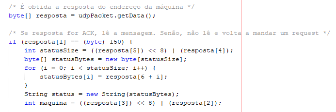

# US 6002 - Enviar Pedido de Reinicialização para uma dada Maquina
===================================================================

# 1. Requisitos

**Descrição** Como SMM, eu pretendo enviar um pedido de reinicialização para uma dada máquina.

**Fluxo principal**

* O Sistema de Monitorização das Máquinas (SMM) deve se encontrar no sistema geral.
* Um utilizador executa o sistema, passando por parâmetro a porta e o endereço de rede a receber o pedido.
* A cada 30 segundos (valor configurado), o sistema envia pedidos HELLO para o endereço de rede passado por parâmetro.
* Quando um endereço responder, caso o pedido seja aceite, o sistema manda um pedido RESET a esse mesmo endereço.

A interpretação feita deste requisito foi no sentido de respeitar as seguintes condições:

* A máquina pode ou não aceitar o pedido HELLO. Caso esse pedido seja recusado, o sistema volta a fazê-lo após o sleeptime definido.
* A máquina pode ou não aceitar o pedido RESET. Caso esse pedido seja recusado, o sistema não volta a fazer mais pedidos. Só fará um novo se um utilizador o voltar a solicitar.
* As mensagens trocadas entre o sistema e os endereços de rede seguem o formato geral explícito no Protocolo de Comunicação disponibilizado.
* O pedido RESET é executado com a introdução de um "argumento de reset" (definido por configuração). Este comando permite que o sistema saiba se irá ou enviar um pedido de RESET a uma máquina ou se irá monitorizar um conjunto delas.
* Os valores configurados (sleeptime, timeout e argumento de RESET) encontram-se representados num ficheiro de configuração, que é "lido" aquando da inicialização do sistema.
* Caso a resposta do endereço ao pedido HELLO ou RESET ultrapasse o timeout, o sistema volta a efetuar um novo pedido HELLO.

**Regras de negócio**

* Tem que ser passado um endereço de rede por parâmetro. Se não for, o sistema termina.
* A porta do serviço a ser usada não pode ser omitida como parâmetro. Se for, o sistema finaliza a atividade.
* A porta do serviço tem que ser um número.
* O sistema não pode ser iniciado sem nenhum parâmetro.
* O "argumento de reset" deve ser introduzido. Se for omitido, o sistema irá interpretar como monitorização da máquina, e não pedido de reinicialização.

**Dependências e correlações**

* Este requisito está dependente da existência de pelo menos 1 máquina com um endereço de rede associado a ela.

# 2. Análise

**Análise do Modelo de Domínio**

A partir da análise do modelo de domínio atual, conclui-se que o mesmo satisfaz as condições exigidas pelo UC.

**Questões em aberto**

* Qual a frequência de ocorrência desde caso de uso?

# 3. Design

## 3.1. Realização da Funcionalidade

O fluxo/sequência que permite realizar a funcionalidade encontra-se descrito no seguinte diagrama de sequência:

## 3.2. Diagrama de Classes

As principais classes envolvidas na realização desta funcionalidade encontram-se descritas no seguinte diagrama:

## 3.3. Padrões Aplicados

| **Questão: Que classe...**          | **Resposta**                       | **Justificação**                                         |
|-------------------------------------|------------------------------------|----------------------------------------------------------|
| ...coordena o UC?                   | SistemaMonitorizacaoMaquinas       | Controller                                               |
| ...valida os parâmetros?            | PedidoMonitorizacaoMaquina         | Information Expert                                       |
| ...envia pedido HELLO?              | PedidoMonitorizacaoMaquina         | Information Expert                                       |
| ...envia pedido RESET?              | PedidoMonitorizacaoMaquina         | Information Expert                                       |

## 3.4. Testes

**Teste 1:** Verificar que não é possível correr o sistema com uma porta que não corresponda a um número.

	@Test(expected = NumberFormatException.class)
		public void ensurePortaIsNumber() {
	    String[] argumentos = new String[2];
		argumentos[0] = XXXX (not a number);
		argumentos[1] = XXXX;
 		PedidoReinicializacaoMaquina instance = new PedidoReinicializacaoMaquina();
        instance.reinicializarMaquina(argumentos);
	}

**Teste 2:** Verificar que não é possível correr o sistema com um endereço de rede e sem nenhuma porta.

	@Test(expected = NumberFormatException.class)
		public void ensurePortaIsPresentWithNetworkAddress() {
	    String[] argumentos = new String[1];
		argumentos[0] = XXXX (one network);
 		PedidoReinicializacaoMaquina instance = new PedidoReinicializacaoMaquina();
        instance.reinicializarMaquina(argumentos);
	}

**Teste 3:** Verificar que não é possível correr o sistema com uma porta e sem nenhum endereço de rede.

	@Test(expected = IllegalArgumentException.class)
		public void ensureAtLeastOneNetworkIsPresent() {
	    String[] argumentos = new String[1];
		argumentos[0] = XXXX (one port);
 		PedidoReinicializacaoMaquina instance = new PedidoReinicializacaoMaquina();
        instance.reinicializarMaquina(argumentos);
	}

**Teste 4:** Verificar que não é possível correr o sistema sem nenhum parâmetro.

	@Test(expected = ArrayIndexOutOfBoundsException.class)
    	public void ensurePortaAndAtLeastOneNetworkArePresent() {
    	String[] argumentos = new String[0];
 		PedidoReinicializacaoMaquina instance = new PedidoReinicializacaoMaquina();
        instance.reinicializarMaquina(argumentos);
    }

**Nota:** Todos os testes vão ser implementados na classe PedidoReinicializacaoMaquinaTest.

# 4. Implementação

**Ficheiro de configuração**

No desenvolvimento deste UC, foi usado um ficheiro de configuração (application.properties), de forma a configurar 1 valore necessários para a realização do mesmo (no caso, o argumento de reset utilizado):

**Código**

O código segue a estrutura implementada no design e o Protocolo de Comunicação disponibilizado. 

A imagem a seguir demonstra que o formato geral das mensagens usadas nas comunicações é seguido:

# 5. Integração/Demonstração

Foram realizadas demonstrações deste caso de uso. Alguns cenários foram testados, nomeadamente:

* Cenário em que o servidor para o qual o pedido é enviado envia uma resposta ACK:

* Cenário em que o servidor para o qual o pedido é enviado envia uma resposta NACK:

# 6. Observações

A equipa acredita que o UC tenha sido bem desenvolvido, existindo uma boa coerência entre o código e a documentação.