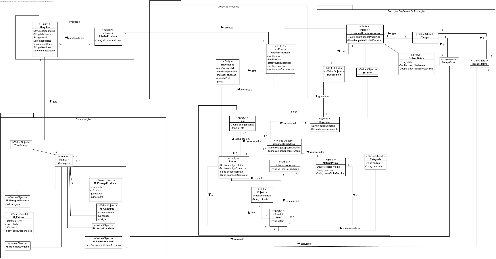

# 1005 - Inicialização de Categorias de Matérias-Primas
=======================================

# 1. Requisitos

**Descrição**: Como **Gestor de Projeto**, eu pretendo que a equipa proceda à inicialização (bootstrap) de algumas categorias de matérias-primas.

**Fluxo Principal**
* O Gestor de Projeto deve estar logado no sistema.
* O Gestor de Projeto deve introduzir os dados necessários de uma categoria.
* O sistema irá posteriormente validar os dados introduzidos e solicitar confirmação.
* No final, o Gestor de Projeto confirma os dados anteriormente introduzidos.

A interpretação feita deste requisito foi no sentido de respeitar as seguintes condições:

* Uma categoria é caracterizada por: um código identificador e uma descrição.

**Regras de negócio**

* O código identificador de uma categoria deve ser único.

# 2. Análise

* A partir da análise do modelo de domínio atual, conclui-se que o mesmo satisfaz as condições exigidas pelo UC.

**Questões em aberto**
* Qual a frequência deste UC?

# 3. Design

Esta funcionalidade não é um verdadeiro UC por isso não será implementada uma UI, será invocada através da aplicação **Bootstarpapp** que guardará num repositório as categorias de matérias-primas atualmente identificadas.

## 3.1. Realização da Funcionalidade

## 3.2. Diagrama de Classes

## 3.3. Padrões Aplicados

| **Questão: Que classe...**       | **Resposta**                       | **Justificação**                                         |
|----------------------------------|------------------------------------|----------------------------------------------------------|
| ...cria/instancia Categoria?     | RegistarCategoriaController        | Creator                                                  |
| ...persiste Categoria?           | CategoriaRepository                | Repository                                               |
| ...cria CategoriaRepository?     | RepositoryFactory                  | Factory                                                  |

## 3.4. Testes
*Nesta secção deve sistematizar como os testes foram concebidos para permitir uma correta aferição da satisfação dos requisitos.*

**Teste 1:** Verificar que não é possível criar uma instância da classe Categoria com um código identificador nulo.

`   @Test(expected = IllegalArgumentException.class)
      public void ensureNullIsNotAllowed() {  
      Categoria instance = new Categoria(null, "XXXX");  
   }`

**Teste 2:** Verificar que não é possível criar uma instância da classe Categoria com uma descrição nula.

`   @Test(expected = IllegalArgumentException.class)
      public void ensureNullIsNotAllowed() {  
      Categoria instance = new Categoria("XXXX", null);  
   }`

**Teste 3:** Verificar que não é possível criar uma instância da classe Categoria com todos os seus valores representativos nulos.

`   @Test(expected = IllegalArgumentException.class)
      public void ensureNullIsNotAllowed() {  
      Categoria instance = new Categoria(null, null);
   }`

**Teste 4:** Verificar que não é possível criar uma instância da classe Categoria com uma descrição vazia.

`   @Test(expected = IllegalArgumentException.class)
      public void ensureNullIsNotAllowed() {
      Categoria instance = new Categoria("XXXX", "");
   }`

**Teste 5:** Verificar que não é possível criar uma instância da classe Categoria com um código identificador vazio.

`   @Test(expected = IllegalArgumentException.class)
      public void ensureNullIsNotAllowed() {
      Categoria instance = new Categoria("", "XXXX");
   }`

**Teste 6:** Verificar que não é possível criar uma instância da classe Categoria com todos os seus valores representativos vazios.

`   @Test(expected = IllegalArgumentException.class)
      public void ensureNullIsNotAllowed() {
      Categoria instance = new Categoria("", "");
   }`

# 4. Implementação

*Nesta secção a equipa deve providenciar, se necessário, algumas evidências de que a implementação está em conformidade com o design efetuado. Para além disso, deve mencionar/descrever a existência de outros ficheiros (e.g. de configuração) relevantes e destacar commits relevantes;*

*Recomenda-se que organize este conteúdo por subsecções.*

# 5. Integração/Demonstração

*Nesta secção a equipa deve descrever os esforços realizados no sentido de integrar a funcionalidade desenvolvida com as restantes funcionalidades do sistema.*

# 6. Observações

*Nesta secção sugere-se que a equipa apresente uma perspetiva critica sobre o trabalho desenvolvido apontando, por exemplo, outras alternativas e ou trabalhos futuros relacionados.*