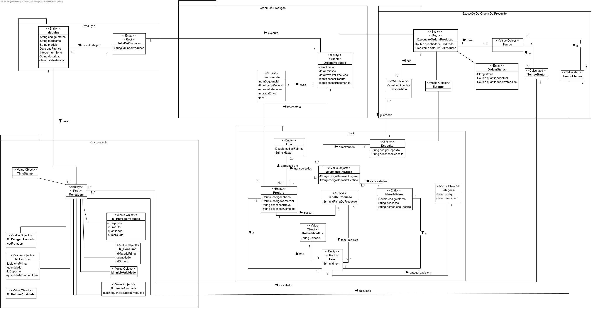

# 3002 - Adicionar Linha de Produção
=======================================

# 1. Requisitos

**Descrição**: Como Gestor de **Chão de Fábrica**, eu pretendo especificar uma nova linha de produção.

**Fluxo Principal**
* O Gestor de Chão de Fábrica deve estar logado no sistema.
* O Gestor de Chão de Fábrica deve introduzir os dados necessários de uma linha de produção.
* O sistema irá posteriormente validar os dados introduzidos e solicitar confirmação.
* No final, o Gestor de Chão de Fábrica confirma os dados anteriormente introduzidos.

A interpretação feita deste requisito foi no sentido de respeitar as seguintes condições:

* Uma linha de produção é caracterizada por: um código identificador.

**Regras de negócio**

* O **ID** de uma linha de produção deve ser um código alfanumérico único.
* Uma **Linha de Produção** possui um conjunto de máquinas associadas.

# 2. Análise

* A partir da análise do modelo de domínio atual, conclui-se que o mesmo satisfaz as condições exigidas pelo UC.

**Questões em aberto**
* Qual a frequência deste UC?

# 3. Design

## 3.1. Realização da Funcionalidade

## 3.2. Diagrama de Classes

## 3.3. Padrões Aplicados

| **Questão: Que classe...**       | **Resposta**                       | **Justificação**                                         |
|----------------------------------|------------------------------------|----------------------------------------------------------|
| ...interage com o utilizador?    | RegistarLinhaProducaoUI                  | Pure Fabrication                                         |
| ...coordena o UC?                | RegistarLinhaProducaoController          | Controller                                               |
| ...cria/instancia LinhaProducao? | RegistarLinhaProducaoController          | Creator                                                  |
| ...persiste LinhaProducao?       | LinhaProducaoRepository                  | Repository                                               |
| ...cria LinhaProducaoRepository?           | RepositoryFactory                        | Factory                                                  |

## 3.4. Testes
*Nesta secção deve sistematizar como os testes foram concebidos para permitir uma correta aferição da satisfação dos requisitos.*

**Teste 1:** Verificar que não é possível criar uma instância da classe LinhaProducao com o identificador de linha de produção nulo .

`   @Test(expected = IllegalArgumentException.class)
      public void ensureNullIsNotAllowed() {  
      LinhaProducao instance = new LinhaProducao(null);  
   }`

**Teste 2:** Verificar que não é possível criar uma instância da classe LinhaProducao com o identificador de linha de produção vazio .

`   @Test(expected = IllegalArgumentException.class)
      public void ensureNullIsNotAllowed() {
      LinhaProducao instance = new LinhaProducao("");
   }`

# 4. Implementação

*Nesta secção a equipa deve providenciar, se necessário, algumas evidências de que a implementação está em conformidade com o design efetuado. Para além disso, deve mencionar/descrever a existência de outros ficheiros (e.g. de configuração) relevantes e destacar commits relevantes;*

*Recomenda-se que organize este conteúdo por subsecções.*

# 5. Integração/Demonstração

*Nesta secção a equipa deve descrever os esforços realizados no sentido de integrar a funcionalidade desenvolvida com as restantes funcionalidades do sistema.*

# 6. Observações

*Nesta secção sugere-se que a equipa apresente uma perspetiva critica sobre o trabalho desenvolvido apontando, por exemplo, outras alternativas e ou trabalhos futuros relacionados.*