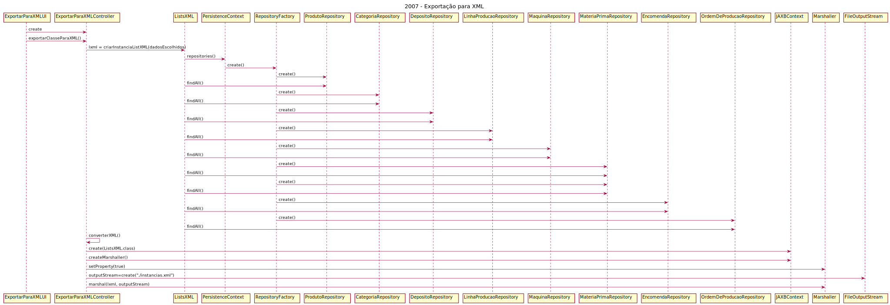

# 2007 - Exportação para XML
=======================================

# 1. Requisitos

**Descrição**: Como **Gestor de Produção**, eu pretendo que a equipa me deixe exportar, para um ficheiro XML, toda a informação subjacente ao chão de fábrica.

**Fluxo Principal**
 * O Gestor de Projeto deve estar logado no sistema.
 * O Gestor de Projeto deve inicializar o processo de exportação.
 * O sistema irá recolher todas a informação subjacente ao chão de fábrica à base de dados e exportará a mesma para XML.

A interpretação feita deste requisito foi no sentido de respeitar as seguintes condições:

* O sistema irá gerar um único ficheiro XML possuindo a informação de todas as instâncias presentes na base de dados

**Regras de negócio**

* ---

# 2. Análise

*Neste secção a equipa deve relatar o estudo/análise/comparação que fez com o intuito de tomar as melhores opções de design para a funcionalidade bem como aplicar diagramas/artefactos de análise adequados.*

*Recomenda-se que organize este conteúdo por subsecções.*

## 2.1 Questões ao cliente

*As questões e respostas aqui transcritas são as que estão presentes no fórum de esclarecimento de requesitos de LAPR4*

--------
**Q**: Em relação à funcionalidade de exportar a informação subjacente ao chão de fábrica, é pretendido que toda a informação seja exportada para um só ficheiro ou pretende-se que, por exemplo, os produtos sejam exportados para um ficheiro, as matérias-primas para um outro ficheiro e assim sucessivamente?

**R**: Sim é suposto exportar toda a informação selecionada para um único ficheiro XML, tendo em consideração os filtros aplicados.

--------
**Q**: Quanto ás fichas técnicas das matérias primas, cujo conteúdo está armazenado em bytes na BD (como refere este tópico) , como é que é suposto aparecer o conteúdo das mesmas no ficheiro XML?

**R**: Podem colocar uma cópia dos ficheiros PDF na mesma pasta do ficheiro XML e. o ficheiro XML tem um referência/link para o ficheiro.

--------
**Q**: Relativamente à questão da aplicação de alguns filtros temporais, não é claro em que informação é que é suposto aplicá-los. Ou seja, como fazemos relativamente a entidades de domínio em que não esteja associada um identificador temporal?

**R**: Obviamente o filtro temporal só se aplica às entidades que dispõe dessa informação.

--------


# 3. Design


## 3.1. Realização da Funcionalidade



## 3.2. Diagrama de Classes


## 3.3. Padrões Aplicados

| **Questão: Que classe...**       | **Resposta**                       | **Justificação**                                         |
|----------------------------------|------------------------------------|----------------------------------------------------------|
| ...interage com o utilizador? | ExportarClasseParaXMLUI | Pure Fabrication    
| ...coordena o UC?                | ExportarClasseParaXMLController| Controller |
| ...cria/instancia Marshaller?       | ExportarClasseParaXMLController         | Creator                                                  |
| ...cria/instancia ListsXML?       | ExportarClasseParaXMLController         | Creator                                                  |
| ...cria/instancia JAXBContext?       | ExportarClasseParaXMLController         | Creator                                                  |
| ...possui as instâncias produto a exportar?       | ProdutoRepository             | Repository.     |
| ...possui as instâncias categoria a exportar?       | CategoriaRepository             | Repository.     |
| ...possui as instâncias matéria-prima a exportar?       | MateriaPrimaRepository             | Repository.     |
| ...possui as instâncias depósito a exportar?       | DepositoRepository             | Repository.     |
| ...possui as instâncias linhas de produção a exportar?       | LinhaProducaoRepository             | Repository.     |
| ...possui as instâncias máquina a exportar?       | MaquinaRepository             | Repository.     |
| ...possui as instâncias encomenda a exportar?       | EncomendaRepository             | Repository.     |
| ...possui as instâncias ordemProducao a exportar?       | OrdemProducaoRepository             | Repository.     |


## 3.4. Testes
*Nesta secção deve sistematizar como os testes foram concebidos para permitir uma correta aferição da satisfação dos requisitos.*


# 4. Implementação

Neste caso de uso, nós iremos fazer a exportação de instâncias para um ficheiro XML. Primeiro perguntamos ao utilizador que dados é que quer exportar e no caso da ordem de produção pedimos também para aplicar um filtro temporal. Com base nas escolhas do utilizador, vamos à base de dados buscar os assets presentes nela relativos ao Chão de Fábrica e exportamos para ficheiros .xml.

# 5. Integração/Demonstração

```xml
<?xml version="1.0" encoding="UTF-8" standalone="yes"?>
<Instâncias>
    <Categoria>
        <codigo>C01</codigo>
        <descricao>01</descricao>
    </Categoria>
    <Categoria>
        <codigo>C02</codigo>
        <descricao>02</descricao>
    </Categoria>
    <Categoria>
        <codigo>C03</codigo>
        <descricao>03</descricao>
    </Categoria>
    <Categoria>
        <codigo>C04</codigo>
        <descricao>04</descricao>
    </Categoria>
    <Categoria>
        <codigo>C05</codigo>
        <descricao>05</descricao>
    </Categoria>
    <Categoria>
        <codigo>C06</codigo>
        <descricao>06</descricao>
    </Categoria>
    <Deposito>
        <codigoDeposito>D001</codigoDeposito>
        <descricaoDeposito>Deposito de produtos finalizados</descricaoDeposito>
    </Deposito>
    <Deposito>
        <codigoDeposito>D002</codigoDeposito>
        <descricaoDeposito>Deposito de materias primas</descricaoDeposito>
    </Deposito>
    <Deposito>
        <codigoDeposito>D003</codigoDeposito>
        <descricaoDeposito>Deposito de produtos semi finalizados</descricaoDeposito>
    </Deposito>
    <Encomenda>
        <idEncomenda>EC2020/00030"</idEncomenda>
    </Encomenda>
    <Encomenda>
        <idEncomenda>EC2020/00031"</idEncomenda>
    </Encomenda>
    <Encomenda>
        <idEncomenda>ENC20</idEncomenda>
        <ordemProducao>
            <dataPrevistaExecucao>2020-02-22</dataPrevistaExecucao>
            <datadeEmissao>2020-02-19</datadeEmissao>
            <execucaoOrdemProducao>
                <quantidadePretendida>100.0</quantidadePretendida>
                <quantidadeProduzida>0.0</quantidadeProduzida>
            </execucaoOrdemProducao>
            <idOrdemProducao>OP40</idOrdemProducao>
            <produto>
                <categoria>
                    <codigo>C05</codigo>
                    <descricao>05</descricao>
                </categoria>
                <codigoComercial>PC01</codigoComercial>
                <codigoFabrico>PF01</codigoFabrico>
                <descricaoBreve>Parafusos</descricaoBreve>
                <descricaoCompleta>Parafusos sextavados feitos de ferro</descricaoCompleta>
                <unidadeMedidaId>0.0 unidades</unidadeMedidaId>
            </produto>
            <unidadeMedida/>
        </ordemProducao>
    </Encomenda>
    <Encomenda>
        <idEncomenda>ENC21</idEncomenda>
        <ordemProducao>
            <dataPrevistaExecucao>2021-02-22</dataPrevistaExecucao>
            <datadeEmissao>2021-02-19</datadeEmissao>
            <execucaoOrdemProducao>
                <quantidadePretendida>50.0</quantidadePretendida>
                <quantidadeProduzida>0.0</quantidadeProduzida>
            </execucaoOrdemProducao>
            <idOrdemProducao>OP41</idOrdemProducao>
            <produto>
                <categoria>
                    <codigo>C06</codigo>
                    <descricao>06</descricao>
                </categoria>
                <codigoComercial>PC02</codigoComercial>
                <codigoFabrico>PF02</codigoFabrico>
                <descricaoBreve>tela estore</descricaoBreve>
                <descricaoCompleta>Tela para estore de rolo blackout</descricaoCompleta>
                <unidadeMedidaId>0.0 metros</unidadeMedidaId>
            </produto>
            <unidadeMedida/>
        </ordemProducao>
    </Encomenda>
    <LinhaProdução>
        <idLinhaProducao>LP001</idLinhaProducao>
    </LinhaProdução>
    <LinhaProdução>
        <idLinhaProducao>LP002</idLinhaProducao>
    </LinhaProdução>
    <LinhaProdução>
        <idLinhaProducao>LP003</idLinhaProducao>
    </LinhaProdução>
    <Maquina>
        <codigoInterno>M001</codigoInterno>
        <descricao>descrição</descricao>
        <marca>Woven</marca>
        <modelo>Woven-1</modelo>
        <numSerie>20201234</numSerie>
        <version>0</version>
    </Maquina>
    <Maquina>
        <codigoInterno>M002</codigoInterno>
        <descricao>descrição</descricao>
        <marca>Cherios</marca>
        <modelo>golden</modelo>
        <numSerie>20202345</numSerie>
        <version>0</version>
    </Maquina>
    <Maquina>
        <codigoInterno>m003</codigoInterno>
        <descricao>descrição</descricao>
        <marca>Woven</marca>
        <modelo>Woven-Meister</modelo>
        <numSerie>20203456</numSerie>
        <version>0</version>
    </Maquina>
    <MateriaPrima>
        <codigoInterno>MP1</codigoInterno>
        <descricao>Vidros</descricao>
        <nomeFichaTecnica>ficha</nomeFichaTecnica>
    </MateriaPrima>
    <MateriaPrima>
        <codigoInterno>MP2</codigoInterno>
        <descricao>Madeira</descricao>
        <nomeFichaTecnica>ficha</nomeFichaTecnica>
    </MateriaPrima>
    <MateriaPrima>
        <codigoInterno>MP3</codigoInterno>
        <descricao>Asfalto</descricao>
        <nomeFichaTecnica>ficha</nomeFichaTecnica>
    </MateriaPrima>
    <OrdemProducao>
        <dataPrevistaExecucao>2020-02-22</dataPrevistaExecucao>
        <datadeEmissao>2020-02-19</datadeEmissao>
        <execucaoOrdemProducao>
            <quantidadePretendida>100.0</quantidadePretendida>
            <quantidadeProduzida>0.0</quantidadeProduzida>
        </execucaoOrdemProducao>
        <idOrdemProducao>OP40</idOrdemProducao>
        <produto>
            <categoria>
                <codigo>C05</codigo>
                <descricao>05</descricao>
            </categoria>
            <codigoComercial>PC01</codigoComercial>
            <codigoFabrico>PF01</codigoFabrico>
            <descricaoBreve>Parafusos</descricaoBreve>
            <descricaoCompleta>Parafusos sextavados feitos de ferro</descricaoCompleta>
            <unidadeMedidaId>0.0 unidades</unidadeMedidaId>
        </produto>
        <unidadeMedida/>
    </OrdemProducao>
    <OrdemProducao>
        <dataPrevistaExecucao>2021-02-22</dataPrevistaExecucao>
        <datadeEmissao>2021-02-19</datadeEmissao>
        <execucaoOrdemProducao>
            <quantidadePretendida>50.0</quantidadePretendida>
            <quantidadeProduzida>0.0</quantidadeProduzida>
        </execucaoOrdemProducao>
        <idOrdemProducao>OP41</idOrdemProducao>
        <produto>
            <categoria>
                <codigo>C06</codigo>
                <descricao>06</descricao>
            </categoria>
            <codigoComercial>PC02</codigoComercial>
            <codigoFabrico>PF02</codigoFabrico>
            <descricaoBreve>tela estore</descricaoBreve>
            <descricaoCompleta>Tela para estore de rolo blackout</descricaoCompleta>
            <unidadeMedidaId>0.0 metros</unidadeMedidaId>
        </produto>
        <unidadeMedida/>
    </OrdemProducao>
    <OrdemProducao>
        <dataPrevistaExecucao>2022-02-22</dataPrevistaExecucao>
        <datadeEmissao>2022-02-19</datadeEmissao>
        <execucaoOrdemProducao>
            <quantidadePretendida>30.0</quantidadePretendida>
            <quantidadeProduzida>0.0</quantidadeProduzida>
        </execucaoOrdemProducao>
        <idOrdemProducao>OP42</idOrdemProducao>
        <produto>
            <categoria>
                <codigo>C04</codigo>
                <descricao>04</descricao>
            </categoria>
            <codigoComercial>PC03</codigoComercial>
            <codigoFabrico>PF03</codigoFabrico>
            <descricaoBreve>Pneu</descricaoBreve>
            <descricaoCompleta>Pneu grande para veiculos pesados</descricaoCompleta>
            <unidadeMedidaId>0.0 kgs</unidadeMedidaId>
        </produto>
        <unidadeMedida/>
    </OrdemProducao>
    <OrdemProducao>
        <dataPrevistaExecucao>1970-01-01</dataPrevistaExecucao>
        <datadeEmissao>1970-01-01</datadeEmissao>
        <encomenda>
            <idEncomenda>EC2020/00030"</idEncomenda>
        </encomenda>
        <execucaoOrdemProducao>
            <quantidadePretendida>65000.0</quantidadePretendida>
            <quantidadeProduzida>0.0</quantidadeProduzida>
        </execucaoOrdemProducao>
        <idOrdemProducao>"100003363</idOrdemProducao>
        <produto>
            <categoria>
                <codigo>C05</codigo>
                <descricao>05</descricao>
            </categoria>
            <codigoComercial>PC01</codigoComercial>
            <codigoFabrico>PF01</codigoFabrico>
            <descricaoBreve>Parafusos</descricaoBreve>
            <descricaoCompleta>Parafusos sextavados feitos de ferro</descricaoCompleta>
            <unidadeMedidaId>0.0 unidades</unidadeMedidaId>
        </produto>
        <unidadeMedida/>
    </OrdemProducao>
    <OrdemProducao>
        <dataPrevistaExecucao>1970-01-01</dataPrevistaExecucao>
        <datadeEmissao>1970-01-01</datadeEmissao>
        <encomenda>
            <idEncomenda>EC2020/00031"</idEncomenda>
        </encomenda>
        <execucaoOrdemProducao>
            <quantidadePretendida>60000.0</quantidadePretendida>
            <quantidadeProduzida>0.0</quantidadeProduzida>
        </execucaoOrdemProducao>
        <idOrdemProducao>"100003364</idOrdemProducao>
        <produto>
            <categoria>
                <codigo>C06</codigo>
                <descricao>06</descricao>
            </categoria>
            <codigoComercial>PC02</codigoComercial>
            <codigoFabrico>PF02</codigoFabrico>
            <descricaoBreve>tela estore</descricaoBreve>
            <descricaoCompleta>Tela para estore de rolo blackout</descricaoCompleta>
            <unidadeMedidaId>0.0 metros</unidadeMedidaId>
        </produto>
        <unidadeMedida/>
    </OrdemProducao>
    <Produto>
        <categoria>
            <codigo>C05</codigo>
            <descricao>05</descricao>
        </categoria>
        <codigoComercial>PC01</codigoComercial>
        <codigoFabrico>PF01</codigoFabrico>
        <descricaoBreve>Parafusos</descricaoBreve>
        <descricaoCompleta>Parafusos sextavados feitos de ferro</descricaoCompleta>
        <unidadeMedidaId>0.0 unidades</unidadeMedidaId>
    </Produto>
    <Produto>
        <categoria>
            <codigo>C06</codigo>
            <descricao>06</descricao>
        </categoria>
        <codigoComercial>PC02</codigoComercial>
        <codigoFabrico>PF02</codigoFabrico>
        <descricaoBreve>tela estore</descricaoBreve>
        <descricaoCompleta>Tela para estore de rolo blackout</descricaoCompleta>
        <unidadeMedidaId>0.0 metros</unidadeMedidaId>
    </Produto>
    <Produto>
        <categoria>
            <codigo>C04</codigo>
            <descricao>04</descricao>
        </categoria>
        <codigoComercial>PC03</codigoComercial>
        <codigoFabrico>PF03</codigoFabrico>
        <descricaoBreve>Pneu</descricaoBreve>
        <descricaoCompleta>Pneu grande para veiculos pesados</descricaoCompleta>
        <unidadeMedidaId>0.0 kgs</unidadeMedidaId>
    </Produto>
</Instâncias>
```

# 6. Observações

*Nesta secção sugere-se que a equipa apresente uma perspetiva critica sobre o trabalho desenvolvido apontando, por exemplo, outras alternativas e ou trabalhos futuros relacionados.*
